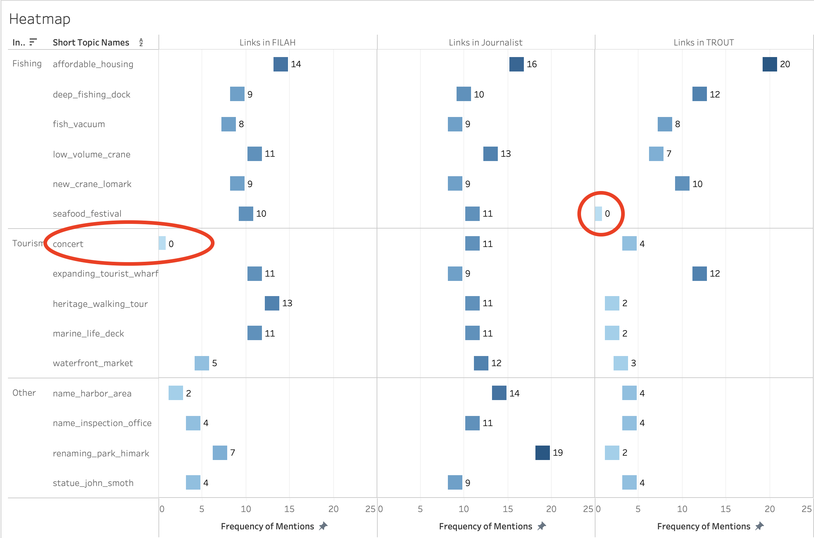
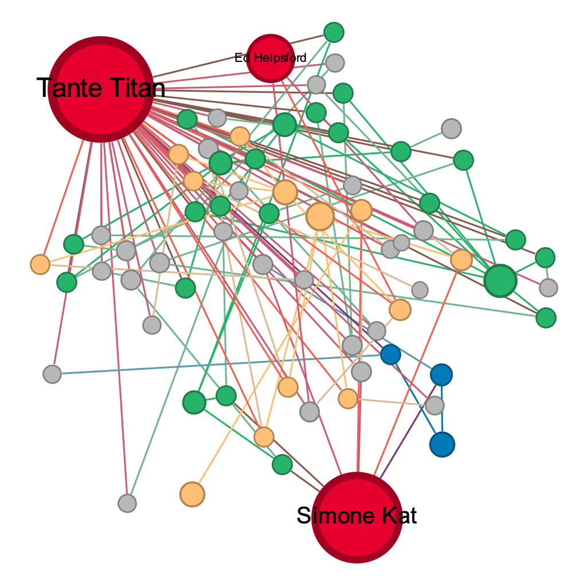
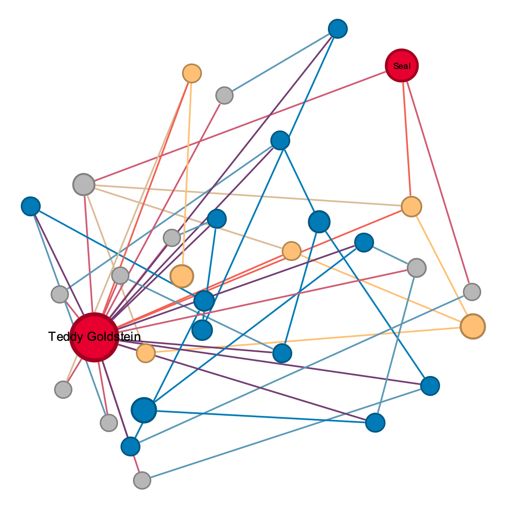
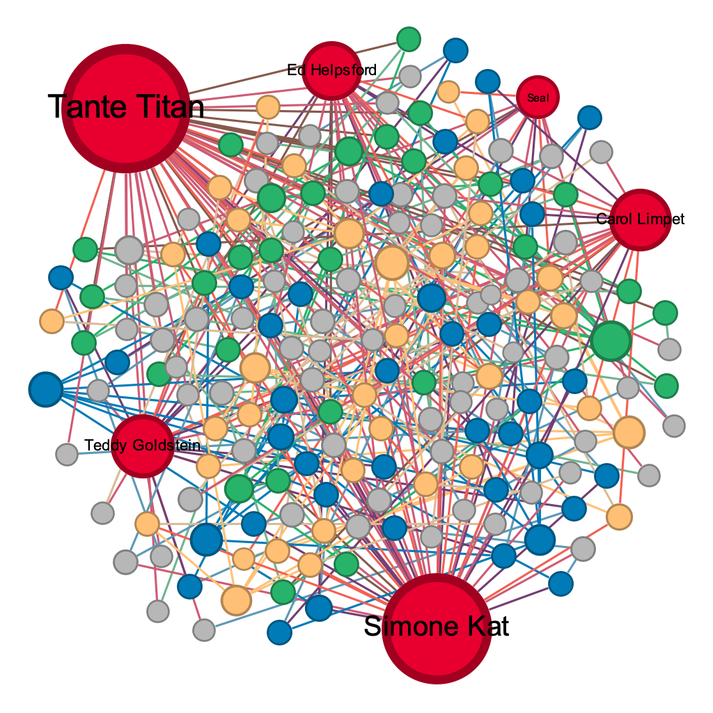

## Overview of Findings

::: {.callout-important appearance="minimal"}
**Central finding:** Neither FILAH's nor TROUT's accusations are fully supported by the complete evidence. Both groups curated their datasets to manufacture a narrative: selecting records that supported their case and quietly omitting those that contradicted it. When viewed through the full journalist dataset, the COOTEFOO board shows near-balanced engagement with both fishing and tourism industries.
:::

What makes this finding analytically interesting is that both groups were working from the same pool of evidence. This was not two independent observers reaching different conclusions. It was two groups with opposing agendas selectively extracting from a shared record.

---

## Q1 — Do FILAH's and TROUT's own datasets support their accusations?

::: {.callout-note appearance="minimal"}
**Answer:** Yes, but the support is manufactured through selective inclusion.
:::

### What each group's data shows

When analysed in isolation, both datasets appear to support their respective accusations:

- **FILAH's data** shows board members engaging with Tourism topics at a mean sentiment of **0.740** versus Fishing topics at only **0.209**. This appears to validate FILAH's claim that the board is biased toward tourism.
- **TROUT's data** shows the exact inverse: Fishing sentiment of **0.720** versus Tourism sentiment of only **0.141**. This appears to validate TROUT's claim of pro-fishing bias.

These are not small differences. They look like compelling evidence.

The dashboard below places all three datasets side by side: the trellis (top left) shows how dramatically sentiment shifts depending on whose records you use, and the Accusations vs Reality chart (bottom right) makes the overstatement explicit.

![**Figure Q1.1 — Sentiment Overview Dashboard.** 
<br>Top row: sentiment bar chart trellis comparing mean sentiment by industry across FILAH (Fishing=0.209, Tourism=0.740), Journalist (Fishing=0.490, Tourism=0.549), and TROUT (Fishing=0.720, Tourism=0.141). 
<br>
Bottom left: Topic coverage heatmap showing frequency of mentions per topic across all three datasets. 
<br>Bottom right: Accusations vs Reality chart directly comparing each group's claimed sentiment against the full journalist baseline.](_site/images/dashboard1.JPG){fig-align="left" width="100%"}

---

### The heatmap evidence

The topic coverage heatmap reveals the mechanism behind the distortion. The two circled cells below are the smoking gun:

- **FILAH recorded zero links for `concert`**: a Tourism topic, while accusing the board of pro-tourism bias.
- **TROUT recorded zero links for `seafood_festival`**: a Fishing topic, while accusing the board of pro-fishing bias.

These are not gaps from incomplete data collection. Both groups removed the topic that most weakened their argument.

{fig-align="left" width="100%"}

---

### The accusations vs reality

Comparing each group's claimed sentiment values against the full journalist baseline makes the overstatement measurable:

| | FILAH claimed | Full reality | Overstatement |
|:--|:-:|:-:|:-:|
| Tourism sentiment | 0.74 | 0.55 | **+0.19** |
| Fishing sentiment (TROUT) | 0.72 | 0.49 | **+0.23** |

Each group overstated the apparent bias by approximately **0.2 sentiment points** through selective inclusion alone, not by fabricating numbers, but by choosing which records to show.

---

## Q2 — Is the COOTEFOO board actually biased?

::: {.callout-note appearance="minimal"}
**Answer:** No. The full dataset shows near-equal engagement with both industries at the board level.
:::

### Board-wide sentiment

Using the complete journalist dataset across all 6 members:

::: {layout-ncol=2}
::: {}
**Fishing**  
Mean sentiment = **0.490**  
43 positive / 10 negative interactions
:::
::: {}
**Tourism**  
Mean sentiment = **0.549**  
58 positive / 6 negative interactions
:::
:::

A difference of **0.059** across a −1 to +1 scale does not constitute meaningful bias. Both industries receive positive engagement.

The chart below shows Board Sentiment Direction (top) and member participation breakdown (bottom) using the full journalist dataset. The green bars vastly outweigh the red across both industries.

{fig-align="left" width="100%"}

The trellis below reinforces this — placing FILAH, Journalist, and TROUT side by side shows that the Journalist dataset sits squarely between the two partisan extremes.

{fig-align="left" width="100%"}

---

### Member-level variation exists — but it is not systemic

Individual members do show different industry orientations:

| Member | Fishing sentiment | Tourism sentiment | Profile |
|:--|:-:|:-:|:--|
| Tante Titan | 0.75 | 0.47 | Broadly positive across both |
| Ed Helpsford | 1.00 | 0.00 | Fishing-positive, tourism-neutral |
| Carol Limpet | — | 0.68 | Tourism-leaning |
| Simone Kat | 0.12 | 0.91 | Strongly tourism-leaning |
| Teddy Goldstein | 0.85 | **−0.50** | Only member with negative industry sentiment |
| Seal | 0.20 | 0.20 | Low but balanced |

The individual variation is real — but it is variation **between members**, not a systematic board-level lean.

{fig-align="left" width="100%"}

{fig-align="left" width="100%"}

---

## Q3 — Are the accusations weakened by the full dataset?

::: {.callout-note appearance="minimal"}
**Answer:** Yes, substantially — for both groups.
:::

### What changed and why

The sentiment scores for individual members do not change between datasets. What changes is **who is present** and **what topics are covered** — and this shifts the overall picture dramatically.

::: {layout-ncol=2}
::: {}
**FILAH excluded:**  
Teddy Goldstein (Fishing=0.85)  
Ed Helpsford (Fishing=1.0)  
Tante Titan (Fishing=0.75)  

→ These three are precisely the strongest pro-fishing members. Their absence drove FILAH's fishing average down to 0.209.
:::
::: {}
**TROUT excluded:**  
Simone Kat (Tourism=0.91)  
Carol Limpet (Tourism=0.68)  
Tante Titan (Tourism=0.47)  

→ These three are precisely the strongest pro-tourism members. Their absence drove TROUT's tourism average down to 0.141.
:::
:::

### The suppression numbers

| | Missing from FILAH | Missing from TROUT |
|:--|:-:|:-:|
| Fishing participation links | 28 | 32 |
| Tourism participation links | 30 | **47** |
| Other participation links | 38 | 41 |

::: {.callout-warning appearance="minimal"}
TROUT suppressed **47 tourism participation links** — more than any other category from either organisation. This is the clearest quantification of editorial bias in the dataset.
:::

{fig-align="left" width="100%"}

---

### The travel evidence

FILAH recorded **15 of 22** travel links. TROUT recorded only **4 of 22**. The near-total absence of travel records from TROUT's dataset is striking — the geographic dimension of board member activity was almost entirely suppressed. Of FILAH's 15 recorded travel links, 7 were to industrial zones associated with fishing activity, directly contradicting their claim of pro-tourism bias.

{fig-align="left" width="100%"}

---

### Tante Titan — the suppressed member

::: {.callout-warning appearance="minimal"}
Tante Titan has **54 participation records** in the journalist dataset — more than any other member. Her engagement is broadly positive (Fishing=0.75, Tourism=0.47, Other=1.0). **Neither FILAH nor TROUT included a single one of her records.**
:::

She does not fit either narrative. She is not dramatically pro-tourism (which would support FILAH's case) nor dramatically pro-fishing (which would support TROUT's case). Her balanced profile made her inconvenient for both groups, so both groups removed her entirely.

---


## Network Graph — Board Member Connections

This interactive network maps each board member's participation across discussions and travel records. Click a board member to highlight their connections. Use the filter buttons to switch between datasets.

```{=html}
<!-- ===== INTERACTIVE NETWORK GRAPH SECTION ===== -->
<!-- Insert this block anywhere in results.html where you want the network to appear -->
<!-- Requires: no external dependencies (uses inline D3 from CDN) -->

<section id="network-graph-section" style="margin: 2.5rem 0;">

  <h2 style="margin-bottom:0.25rem;">Network Graph — Board Member Connections</h2>
  <p style="color:#555; margin-bottom:1rem;">
    This interactive network maps each board member's participation across discussions and travel records.
    Node size reflects connection count. Edge colour reflects dataset source.
    <strong>Click a board member</strong> to highlight their connections. Use the filters to explore by dataset or industry.
  </p>

  <!-- Controls -->
  <div id="network-controls" style="display:flex; flex-wrap:wrap; gap:0.6rem; margin-bottom:1rem; align-items:center;">
    <label style="font-weight:600; font-size:0.85rem;">Filter by dataset:</label>
    <button class="net-btn active" data-filter="all">All</button>
    <button class="net-btn" data-filter="FILAH">FILAH only</button>
    <button class="net-btn" data-filter="TROUT">TROUT only</button>
    <button class="net-btn" data-filter="Journalist Only">Journalist Only</button>
    <button class="net-btn" data-filter="FILAH+TROUT">FILAH + TROUT</button>
    <span style="margin-left:auto; font-size:0.8rem; color:#888;" id="net-status">174 edges shown</span>
  </div>

  <!-- Legend -->
  <div style="display:flex; flex-wrap:wrap; gap:1.2rem; margin-bottom:0.75rem; font-size:0.8rem;">
    <div><span style="display:inline-block;width:12px;height:12px;border-radius:50%;background:#e63946;margin-right:4px;vertical-align:middle;"></span>Board Member</div>
    <div><span style="display:inline-block;width:12px;height:12px;border-radius:3px;background:#457b9d;margin-right:4px;vertical-align:middle;"></span>Tourism Discussion</div>
    <div><span style="display:inline-block;width:12px;height:12px;border-radius:3px;background:#e9a900;margin-right:4px;vertical-align:middle;"></span>Fishing Discussion</div>
    <div><span style="display:inline-block;width:12px;height:12px;border-radius:3px;background:#aaa;margin-right:4px;vertical-align:middle;"></span>Other / No Industry</div>
    <div style="margin-left:1rem; font-weight:600;">Edge colour:</div>
    <div><span style="display:inline-block;width:28px;height:3px;background:#e63946;margin-right:4px;vertical-align:middle;"></span>FILAH</div>
    <div><span style="display:inline-block;width:28px;height:3px;background:#457b9d;margin-right:4px;vertical-align:middle;"></span>TROUT</div>
    <div><span style="display:inline-block;width:28px;height:3px;background:#2a9d8f;margin-right:4px;vertical-align:middle;"></span>Journalist Only</div>
    <div><span style="display:inline-block;width:28px;height:3px;background:#6a4c93;margin-right:4px;vertical-align:middle;"></span>FILAH+TROUT</div>
  </div>

  <!-- Canvas -->
  <div id="network-container" style="border:1px solid #ddd; border-radius:8px; background:#fafafa; position:relative; overflow:hidden;">
    <svg id="network-svg" style="width:100%; height:560px; display:block;"></svg>
    <!-- Tooltip -->
    <div id="net-tooltip" style="
      position:absolute; display:none; background:rgba(20,20,20,0.88); color:#fff;
      padding:8px 12px; border-radius:6px; font-size:0.78rem; max-width:260px;
      pointer-events:none; line-height:1.5; z-index:10;
    "></div>
  </div>

  <p style="font-size:0.75rem; color:#888; margin-top:0.4rem;">
    Drag nodes to rearrange. Scroll to zoom. Click board members (red) to highlight connections. Click background to reset.
  </p>

  <!-- Static Gephi images toggle -->
  <details style="margin-top:1.5rem;">
    <summary style="cursor:pointer; font-weight:600; color:#1d3557;">▶ View static Gephi exports</summary>
    <div style="display:flex; flex-wrap:wrap; gap:1rem; margin-top:1rem;">
      <div style="flex:1; min-width:280px;">
        <p style="font-size:0.8rem; color:#555; margin-bottom:4px;"><strong>Tante Titan</strong> — 54 records, absent from both FILAH and TROUT</p>
        
      </div>
      <div style="flex:1; min-width:280px;">
        <p style="font-size:0.8rem; color:#555; margin-bottom:4px;"><strong>Teddy Goldstein</strong> — Only in TROUT; hidden by FILAH entirely</p>
        
      </div>
      <div style="flex:1; min-width:280px;">
        <p style="font-size:0.8rem; color:#555; margin-bottom:4px;"><strong>Full journalist network</strong> — all 6 board members, all topics</p>
        
      </div>
    </div>
  </details>

</section>

<!-- Button styles -->
<style>
.net-btn {
  padding: 4px 10px;
  border: 1px solid #ccc;
  border-radius: 4px;
  background: #fff;
  cursor: pointer;
  font-size: 0.8rem;
  transition: all 0.15s;
}
.net-btn:hover { background: #f0f0f0; }
.net-btn.active { background: #1d3557; color: #fff; border-color: #1d3557; }
</style>

<!-- D3 force-directed network -->
<script src="https://cdnjs.cloudflare.com/ajax/libs/d3/7.8.5/d3.min.js"></script>
<script>
(function() {

const GRAPH_DATA = {"nodes":[{"id":"renaming_park_himark_Travel_Anchor_Way_Grill","label":"renaming park himark Travel Anchor Way Grill","type":"Other","industry":""},{"id":"new_crane_lomark_Meeting_8_Share_Findings","label":"New Crane Lomark | Meeting 8 Share Findings","type":"Other","industry":""},{"id":"waterfront_market_Meeting_9_Report_Discussion","label":"Waterfront Market | Meeting 9 Report Discussion","type":"Discussion","industry":"Tourism"},{"id":"expanding_tourist_wharf_Travel_Harbor_Route_Solutions","label":"expanding tourist wharf Travel Harbor Route Solutions","type":"Other","industry":""},{"id":"seafood_festival_Meeting_1_Feasibility","label":"Seafood Festival | Meeting 1 Feasibility","type":"Other","industry":""},{"id":"low_volume_crane_Travel_Harbor_Builders_Completed_Discussion","label":"low volume crane Travel Harbor Builders Completed Discussion","type":"Discussion","industry":"Fishing"},{"id":"seafood_festival_Meeting_3_Take_Action","label":"Seafood Festival | Meeting 3 Take Action","type":"Other","industry":""},{"id":"renaming_park_himark_Meeting_5_Nominations","label":"Renaming Park Himark | Meeting 5 Nominations","type":"Other","industry":""},{"id":"Teddy Goldstein","label":"Teddy Goldstein","type":"Board Member","industry":""},{"id":"renaming_park_himark_Meeting_7_Announce_Name_Discussion","label":"Renaming Park Himark | Meeting 7 Announce Name Discussion","type":"Discussion","industry":"Other"},{"id":"statue_john_smoth_Travel_The_Bait_Stich_Discussion","label":"statue john smoth Travel The Bait Stich Discussion","type":"Discussion","industry":"Other"},{"id":"expanding_tourist_wharf_Meeting_9_Start_Report_Discussion","label":"Expanding Tourist Wharf | Meeting 9 Start Report Discussion","type":"Discussion","industry":"Tourism"},{"id":"waterfront_market_Travel_Harborfront_Market_Completed_Discussion","label":"waterfront market Travel Harborfront Market Completed Discussion","type":"Discussion","industry":"Tourism"},{"id":"name_harbor_area_Meeting_11_Draft_Names_Discussion","label":"Name Harbor Area | Meeting 11 Draft Names Discussion","type":"Discussion","industry":"Other"},{"id":"statue_john_smoth_Meeting_8_Proposal_Discussion","label":"Statue John Smoth | Meeting 8 Proposal Discussion","type":"Discussion","industry":"Other"},{"id":"statue_john_smoth_Meeting_10_Presentation","label":"Statue John Smoth | Meeting 10 Presentation","type":"Other","industry":""},{"id":"affordable_housing_Meeting_8_Gather_Feedback_Discussion","label":"Affordable Housing | Meeting 8 Gather Feedback Discussion","type":"Discussion","industry":"Fishing"},{"id":"expanding_tourist_wharf_Travel_Harbor_Route_Solutions_Completed_Discussion_Tourist","label":"expanding tourist wharf Travel Harbor Route Solutions Completed Discussion Tourist","type":"Discussion","industry":"Tourism"},{"id":"renaming_park_himark_Travel_Himark_City_Hall","label":"renaming park himark Travel Himark City Hall","type":"Other","industry":""},{"id":"heritage_walking_tour_Travel_Captain_Market_Completed_Discussion","label":"heritage walking tour Travel Captain Market Completed Discussion","type":"Discussion","industry":"Tourism"},{"id":"deep_fishing_dock_Travel_High_Seas_Fishing_Inc_Completed_Discussion","label":"deep fishing dock Travel High Seas Fishing Inc Completed Discussion","type":"Discussion","industry":"Fishing"},{"id":"heritage_walking_tour_Meeting_9_Report","label":"Heritage Walking Tour | Meeting 9 Report","type":"Other","industry":""},{"id":"heritage_walking_tour_Meeting_8_Proposal_Discussion","label":"Heritage Walking Tour | Meeting 8 Proposal Discussion","type":"Discussion","industry":"Tourism"},{"id":"marine_life_deck_Travel_Tropics_Environmental_Hub","label":"marine life deck Travel Tropics Environmental Hub","type":"Other","industry":""},{"id":"concert_Meeting_7_Concert_Issues","label":"Concert | Meeting 7 Concert Issues","type":"Other","industry":""},{"id":"name_harbor_area_Meeting_12_Public_Opinion","label":"Name Harbor Area | Meeting 12 Public Opinion","type":"Other","industry":""},{"id":"low_volume_crane_Meeting_3_Proposal_Discussion","label":"Low Volume Crane | Meeting 3 Proposal Discussion","type":"Discussion","industry":"Fishing"},{"id":"seafood_festival_Travel_Dock_Roll_Hall_of_Fame","label":"seafood festival Travel Dock Roll Hall of Fame","type":"Other","industry":""},{"id":"waterfront_market_Travel_Harbor_Edge_Grill_Completed_Discussion","label":"waterfront market Travel Harbor Edge Grill Completed Discussion","type":"Discussion","industry":"Tourism"},{"id":"seafood_festival_Meeting_3_Take_Action_Discussion","label":"Seafood Festival | Meeting 3 Take Action Discussion","type":"Discussion","industry":"Fishing"},{"id":"marine_life_deck_Meeting_12_Detailed_Proposal_Discussion","label":"Marine Life Deck | Meeting 12 Detailed Proposal Discussion","type":"Discussion","industry":"Tourism"},{"id":"seafood_festival_Meeting_2_Feedback_Discussion","label":"Seafood Festival | Meeting 2 Feedback Discussion","type":"Discussion","industry":"Fishing"},{"id":"expanding_tourist_wharf_Meeting_10_Report_Update_Discussion","label":"Expanding Tourist Wharf | Meeting 10 Report Update Discussion","type":"Discussion","industry":"Tourism"},{"id":"marine_life_deck_Meeting_10_Initial_Ideas","label":"Marine Life Deck | Meeting 10 Initial Ideas","type":"Other","industry":""},{"id":"waterfront_market_Travel_Harborfront_Market","label":"waterfront market Travel Harborfront Market","type":"Other","industry":""},{"id":"name_harbor_area_Meeting_11_Draft_Names","label":"Name Harbor Area | Meeting 11 Draft Names","type":"Other","industry":""},{"id":"waterfront_market_Travel_Harbor_Edge_Grill_Discussion","label":"waterfront market Travel Harbor Edge Grill Discussion","type":"Discussion","industry":"Tourism"},{"id":"affordable_housing_Meeting_7_Debate","label":"Affordable Housing | Meeting 7 Debate","type":"Other","industry":""},{"id":"marine_life_deck_Meeting_12_Environmental_Impact_Report_Discussion","label":"Marine Life Deck | Meeting 12 Environmental Impact Report Discussion","type":"Discussion","industry":"Tourism"},{"id":"affordable_housing_Travel_Tidewater_Flats","label":"affordable housing Travel Tidewater Flats","type":"Other","industry":""},{"id":"deep_fishing_dock_Meeting_3_Maintenance_Plan","label":"Deep Fishing Dock | Meeting 3 Maintenance Plan","type":"Other","industry":""},{"id":"statue_john_smoth_Meeting_9_Gather_Feedback_Discussion","label":"Statue John Smoth | Meeting 9 Gather Feedback Discussion","type":"Discussion","industry":"Other"},{"id":"Simone Kat","label":"Simone Kat","type":"Board Member","industry":""},{"id":"affordable_housing_Travel_Waveside_Townhomes_Completed_Discussion","label":"affordable housing Travel Waveside Townhomes Completed Discussion","type":"Discussion","industry":"Fishing"},{"id":"affordable_housing_Travel_Tidewater_Flats_Discussion","label":"affordable housing Travel Tidewater Flats Discussion","type":"Discussion","industry":"Fishing"},{"id":"name_harbor_area_Meeting_12_Public_Opinion_Discussion","label":"Name Harbor Area | Meeting 12 Public Opinion Discussion","type":"Discussion","industry":"Other"},{"id":"name_harbor_area_Travel_Harbor_Odyssey_Tours","label":"name harbor area Travel Harbor Odyssey Tours","type":"Other","industry":""},{"id":"fish_vacuum_Travel_Bay_Harvest_Corporation","label":"fish vacuum Travel Bay Harvest Corporation","type":"Other","industry":""},{"id":"low_volume_crane_Travel_Harbor_Route_Solutions_Completed_Discussion_Crane","label":"low volume crane Travel Harbor Route Solutions Completed Discussion Crane","type":"Discussion","industry":"Fishing"},{"id":"deep_fishing_dock_Travel_High_Seas_Fishing_Inc","label":"deep fishing dock Travel High Seas Fishing Inc","type":"Other","industry":""},{"id":"low_volume_crane_Travel_Haacklee_Assembly_Co_Completed_Discussion","label":"low volume crane Travel Haacklee Assembly Co Completed Discussion","type":"Discussion","industry":"Fishing"},{"id":"heritage_walking_tour_Meeting_7_Discussion","label":"Heritage Walking Tour | Meeting 7 Discussion","type":"Discussion","industry":"Tourism"},{"id":"name_inspection_office_Meeting_8_Proposal_Discussion","label":"Name Inspection Office | Meeting 8 Proposal Discussion","type":"Discussion","industry":"Other"},{"id":"name_harbor_area_Travel_The_Bait_Stich_Discussion","label":"name harbor area Travel The Bait Stich Discussion","type":"Discussion","industry":"Other"},{"id":"renaming_park_himark_Travel_Sailors_Perch_Light_Completed_Discussion","label":"renaming park himark Travel Sailors Perch Light Completed Discussion","type":"Discussion","industry":"Other"},{"id":"waterfront_market_Meeting_8_Gather_Feedback","label":"Waterfront Market | Meeting 8 Gather Feedback","type":"Other","industry":""},{"id":"waterfront_market_Meeting_7_Discussion","label":"Waterfront Market | Meeting 7 Discussion","type":"Discussion","industry":"Tourism"},{"id":"concert_Meeting_16_Road_Closures","label":"Concert | Meeting 16 Road Closures","type":"Other","industry":""},{"id":"deep_fishing_dock_Travel_High_Seas_Fishing_Inc_Discussion","label":"deep fishing dock Travel High Seas Fishing Inc Discussion","type":"Discussion","industry":"Fishing"},{"id":"low_volume_crane_Travel_Harbor_Route_Solutions","label":"low volume crane Travel Harbor Route Solutions","type":"Other","industry":""},{"id":"expanding_tourist_wharf_Meeting_11_Report_Update_Discussion","label":"Expanding Tourist Wharf | Meeting 11 Report Update Discussion","type":"Discussion","industry":"Tourism"},{"id":"name_inspection_office_Travel_Lomark_Civic_Plaza","label":"name inspection office Travel Lomark Civic Plaza","type":"Other","industry":""},{"id":"name_harbor_area_Travel_The_Bait_Stich_Completed_Discussion","label":"name harbor area Travel The Bait Stich Completed Discussion","type":"Discussion","industry":"Other"},{"id":"fish_vacuum_Meeting_3_Report_Discussion","label":"Fish Vacuum | Meeting 3 Report Discussion","type":"Discussion","industry":"Fishing"},{"id":"Ed Helpsford","label":"Ed Helpsford","type":"Board Member","industry":""},{"id":"renaming_park_himark_Travel_Anchor_Way_Grill_Completed_Discussion","label":"renaming park himark Travel Anchor Way Grill Completed Discussion","type":"Discussion","industry":"Other"},{"id":"affordable_housing_Meeting_10_Travel_Findings_Discussion","label":"Affordable Housing | Meeting 10 Travel Findings Discussion","type":"Discussion","industry":"Fishing"},{"id":"concert_Travel_Paakland_Elementary_Completed_Discussion","label":"concert Travel Paakland Elementary Completed Discussion","type":"Discussion","industry":"Tourism"},{"id":"marine_life_deck_Travel_Tropics_Environmental_Hub_Discussion","label":"marine life deck Travel Tropics Environmental Hub Discussion","type":"Discussion","industry":"Tourism"},{"id":"marine_life_deck_Meeting_11_Feedback_Discussion","label":"Marine Life Deck | Meeting 11 Feedback Discussion","type":"Discussion","industry":"Tourism"},{"id":"deep_fishing_dock_Meeting_4_Findings_Report_Discussion","label":"Deep Fishing Dock | Meeting 4 Findings Report Discussion","type":"Discussion","industry":"Fishing"},{"id":"fish_vacuum_Travel_Bay_Harvest_Corporation_Discussion","label":"fish vacuum Travel Bay Harvest Corporation Discussion","type":"Discussion","industry":"Fishing"},{"id":"deep_fishing_dock_Meeting_3_Maintenance_Plan_Discussion","label":"Deep Fishing Dock | Meeting 3 Maintenance Plan Discussion","type":"Discussion","industry":"Fishing"},{"id":"affordable_housing_Meeting_10_Housing_Proposal","label":"Affordable Housing | Meeting 10 Housing Proposal","type":"Other","industry":""},{"id":"renaming_park_himark_Meeting_4_Name_Ideas_Discussion","label":"Renaming Park Himark | Meeting 4 Name Ideas Discussion","type":"Discussion","industry":"Other"},{"id":"waterfront_market_Travel_Harbor_Edge_Grill","label":"waterfront market Travel Harbor Edge Grill","type":"Other","industry":""},{"id":"heritage_walking_tour_Travel_Captain_Market","label":"heritage walking tour Travel Captain Market","type":"Other","industry":""},{"id":"deep_fishing_dock_Meeting_4_Recommendation_Discussion","label":"Deep Fishing Dock | Meeting 4 Recommendation Discussion","type":"Discussion","industry":"Fishing"},{"id":"statue_john_smoth_Travel_The_Bait_Stich","label":"statue john smoth Travel The Bait Stich","type":"Other","industry":""},{"id":"waterfront_market_Meeting_9_Report","label":"Waterfront Market | Meeting 9 Report","type":"Other","industry":""},{"id":"seafood_festival_Travel_Dock_Roll_Hall_of_Fame_Discussion","label":"seafood festival Travel Dock Roll Hall of Fame Discussion","type":"Discussion","industry":"Fishing"},{"id":"name_harbor_area_Travel_The_Bait_Stich","label":"name harbor area Travel The Bait Stich","type":"Other","industry":""},{"id":"heritage_walking_tour_Meeting_9_Take_Action_Discussion","label":"Heritage Walking Tour | Meeting 9 Take Action Discussion","type":"Discussion","industry":"Tourism"},{"id":"expanding_tourist_wharf_Meeting_9_Report","label":"Expanding Tourist Wharf | Meeting 9 Report","type":"Other","industry":""},{"id":"heritage_walking_tour_Meeting_8_Proposal","label":"Heritage Walking Tour | Meeting 8 Proposal","type":"Other","industry":""},{"id":"seafood_festival_Meeting_3_Report_Discussion","label":"Seafood Festival | Meeting 3 Report Discussion","type":"Discussion","industry":"Fishing"},{"id":"statue_john_smoth_Meeting_10_Presentation_Discussion","label":"Statue John Smoth | Meeting 10 Presentation Discussion","type":"Discussion","industry":"Other"},{"id":"marine_life_deck_Meeting_11_Feedback","label":"Marine Life Deck | Meeting 11 Feedback","type":"Other","industry":""},{"id":"renaming_park_himark_Meeting_5_Nominations_Discussion","label":"Renaming Park Himark | Meeting 5 Nominations Discussion","type":"Discussion","industry":"Other"},{"id":"affordable_housing_Travel_Waveside_Townhomes_Discussion","label":"affordable housing Travel Waveside Townhomes Discussion","type":"Discussion","industry":"Fishing"},{"id":"expanding_tourist_wharf_Travel_Harbor_Route_Solutions_Discussion_Tourist","label":"expanding tourist wharf Travel Harbor Route Solutions Discussion Tourist","type":"Discussion","industry":"Tourism"},{"id":"expanding_tourist_wharf_Meeting_7_Initial_Views_Discussion","label":"Expanding Tourist Wharf | Meeting 7 Initial Views Discussion","type":"Discussion","industry":"Tourism"},{"id":"renaming_park_himark_Meeting_7_Unveiling_Event_Discussion","label":"Renaming Park Himark | Meeting 7 Unveiling Event Discussion","type":"Discussion","industry":"Other"},{"id":"low_volume_crane_Meeting_3_Proposal","label":"Low Volume Crane | Meeting 3 Proposal","type":"Other","industry":""},{"id":"marine_life_deck_Meeting_12_Detailed_Proposal","label":"Marine Life Deck | Meeting 12 Detailed Proposal","type":"Other","industry":""},{"id":"deep_fishing_dock_Meeting_4_Findings_Report","label":"Deep Fishing Dock | Meeting 4 Findings Report","type":"Other","industry":""},{"id":"Tante Titan","label":"Tante Titan","type":"Board Member","industry":""},{"id":"statue_john_smoth_Travel_The_Bait_Stich_Completed_Discussion","label":"statue john smoth Travel The Bait Stich Completed Discussion","type":"Discussion","industry":"Other"},{"id":"affordable_housing_Travel_Waveside_Townhomes","label":"affordable housing Travel Waveside Townhomes","type":"Other","industry":""},{"id":"concert_Meeting_16_Feedback_Discussion","label":"Concert | Meeting 16 Feedback Discussion","type":"Discussion","industry":"Tourism"},{"id":"fish_vacuum_Meeting_3_Report","label":"Fish Vacuum | Meeting 3 Report","type":"Other","industry":""},{"id":"seafood_festival_Travel_Dock_Roll_Hall_of_Fame_Completed_Discussion","label":"seafood festival Travel Dock Roll Hall of Fame Completed Discussion","type":"Discussion","industry":"Fishing"},{"id":"name_inspection_office_Meeting_14_Announcement","label":"Name Inspection Office | Meeting 14 Announcement","type":"Other","industry":""},{"id":"concert_Meeting_16_Communication_Complaints","label":"Concert | Meeting 16 Communication Complaints","type":"Other","industry":""},{"id":"low_volume_crane_Meeting_8_Report","label":"Low Volume Crane | Meeting 8 Report","type":"Other","industry":""},{"id":"name_inspection_office_Meeting_14_Announcement_Discussion","label":"Name Inspection Office | Meeting 14 Announcement Discussion","type":"Discussion","industry":"Other"},{"id":"concert_Meeting_16_Road_Closures_Discussion","label":"Concert | Meeting 16 Road Closures Discussion","type":"Discussion","industry":"Tourism"},{"id":"fish_vacuum_Meeting_1_Introduction","label":"Fish Vacuum | Meeting 1 Introduction","type":"Other","industry":""},{"id":"heritage_walking_tour_Meeting_9_Report_Discussion","label":"Heritage Walking Tour | Meeting 9 Report Discussion","type":"Discussion","industry":"Tourism"},{"id":"seafood_festival_Meeting_3_Report","label":"Seafood Festival | Meeting 3 Report","type":"Other","industry":""},{"id":"renaming_park_himark_Meeting_8_Compile_Nominations_Discussion","label":"Renaming Park Himark | Meeting 8 Compile Nominations Discussion","type":"Discussion","industry":"Other"},{"id":"new_crane_lomark_Travel_Blue_Wave_Shipping","label":"new crane lomark Travel Blue Wave Shipping","type":"Other","industry":""},{"id":"Seal","label":"Seal","type":"Board Member","industry":""},{"id":"renaming_park_himark_Travel_Himark_City_Hall_Discussion","label":"renaming park himark Travel Himark City Hall Discussion","type":"Discussion","industry":"Other"},{"id":"marine_life_deck_Travel_Tropics_Environmental_Hub_Completed_Discussion","label":"marine life deck Travel Tropics Environmental Hub Completed Discussion","type":"Discussion","industry":"Tourism"},{"id":"concert_Meeting_16_Communication_Complaints_Discussion","label":"Concert | Meeting 16 Communication Complaints Discussion","type":"Discussion","industry":"Tourism"},{"id":"waterfront_market_Meeting_7_Benefits_Feasibility","label":"Waterfront Market | Meeting 7 Benefits Feasibility","type":"Other","industry":""},{"id":"affordable_housing_Meeting_7_Debate_Discussion","label":"Affordable Housing | Meeting 7 Debate Discussion","type":"Discussion","industry":"Fishing"},{"id":"low_volume_crane_Travel_Harbor_Builders","label":"low volume crane Travel Harbor Builders","type":"Other","industry":""},{"id":"renaming_park_himark_Travel_Sailors_Perch_Light_Discussion","label":"renaming park himark Travel Sailors Perch Light Discussion","type":"Discussion","industry":"Other"},{"id":"new_crane_lomark_Meeting_5_Cost_Impact_Report","label":"New Crane Lomark | Meeting 5 Cost Impact Report","type":"Other","industry":""},{"id":"low_volume_crane_Travel_Harbor_Route_Solutions_Discussion","label":"low volume crane Travel Harbor Route Solutions Discussion","type":"Discussion","industry":"Fishing"},{"id":"renaming_park_himark_Meeting_4_Name_Ideas","label":"Renaming Park Himark | Meeting 4 Name Ideas","type":"Other","industry":""},{"id":"expanding_tourist_wharf_Meeting_8_Expand_Ideas_Discussion","label":"Expanding Tourist Wharf | Meeting 8 Expand Ideas Discussion","type":"Discussion","industry":"Tourism"},{"id":"name_inspection_office_Travel_Lomark_Civic_Plaza_Completed_Discussion","label":"name inspection office Travel Lomark Civic Plaza Completed Discussion","type":"Discussion","industry":"Other"},{"id":"name_inspection_office_Meeting_9_Community_Vote","label":"Name Inspection Office | Meeting 9 Community Vote","type":"Other","industry":""},{"id":"concert_Meeting_7_Discussion","label":"Concert | Meeting 7 Discussion","type":"Discussion","industry":"Tourism"},{"id":"name_harbor_area_Travel_Harbor_Odyssey_Tours_Completed_Discussion","label":"name harbor area Travel Harbor Odyssey Tours Completed Discussion","type":"Discussion","industry":"Other"},{"id":"concert_Meeting_16_Feedback","label":"Concert | Meeting 16 Feedback","type":"Other","industry":""},{"id":"new_crane_lomark_Travel_Blue_Wave_Shipping_Discussion","label":"new crane lomark Travel Blue Wave Shipping Discussion","type":"Discussion","industry":"Fishing"},{"id":"renaming_park_himark_Meeting_7_Unveiling_Event","label":"Renaming Park Himark | Meeting 7 Unveiling Event","type":"Other","industry":""},{"id":"renaming_park_himark_Meeting_7_Announce_Name","label":"Renaming Park Himark | Meeting 7 Announce Name","type":"Other","industry":""},{"id":"waterfront_market_Travel_Harborfront_Market_Discussion","label":"waterfront market Travel Harborfront Market Discussion","type":"Discussion","industry":"Tourism"},{"id":"new_crane_lomark_Travel_Blue_Wave_Shipping_Completed_Discussion","label":"new crane lomark Travel Blue Wave Shipping Completed Discussion","type":"Discussion","industry":"Fishing"},{"id":"statue_john_smoth_Meeting_8_Proposal","label":"Statue John Smoth | Meeting 8 Proposal","type":"Other","industry":""},{"id":"fish_vacuum_Travel_Bay_Harvest_Corporation_Completed_Discussion","label":"fish vacuum Travel Bay Harvest Corporation Completed Discussion","type":"Discussion","industry":"Fishing"},{"id":"fish_vacuum_Meeting_1_Introduction_Discussion","label":"Fish Vacuum | Meeting 1 Introduction Discussion","type":"Discussion","industry":"Fishing"},{"id":"name_inspection_office_Travel_Lomark_Civic_Plaza_Discussion","label":"name inspection office Travel Lomark Civic Plaza Discussion","type":"Discussion","industry":"Other"},{"id":"statue_john_smoth_Meeting_9_Feedback","label":"Statue John Smoth | Meeting 9 Feedback","type":"Other","industry":""},{"id":"new_crane_lomark_Meeting_8_Share_Findings_Discussion","label":"New Crane Lomark | Meeting 8 Share Findings Discussion","type":"Discussion","industry":"Fishing"},{"id":"deep_fishing_dock_Meeting_4_Recommendation","label":"Deep Fishing Dock | Meeting 4 Recommendation","type":"Other","industry":""},{"id":"renaming_park_himark_Travel_Anchor_Way_Grill_Discussion","label":"renaming park himark Travel Anchor Way Grill Discussion","type":"Discussion","industry":"Other"},{"id":"affordable_housing_Travel_Tidewater_Flats_Completed_Discussion","label":"affordable housing Travel Tidewater Flats Completed Discussion","type":"Discussion","industry":"Fishing"},{"id":"heritage_walking_tour_Meeting_7_Outline","label":"Heritage Walking Tour | Meeting 7 Outline","type":"Other","industry":""},{"id":"affordable_housing_Meeting_8_Feedback","label":"Affordable Housing | Meeting 8 Feedback","type":"Other","industry":""},{"id":"renaming_park_himark_Meeting_8_Compile_Nominations","label":"Renaming Park Himark | Meeting 8 Compile Nominations","type":"Other","industry":""},{"id":"seafood_festival_Meeting_2_Feedback","label":"Seafood Festival | Meeting 2 Feedback","type":"Other","industry":""},{"id":"new_crane_lomark_Meeting_5_Cost_Impact_Report_Discussion","label":"New Crane Lomark | Meeting 5 Cost Impact Report Discussion","type":"Discussion","industry":"Fishing"},{"id":"Carol Limpet","label":"Carol Limpet","type":"Board Member","industry":""},{"id":"waterfront_market_Meeting_8_Gather_Feedback_Discussion","label":"Waterfront Market | Meeting 8 Gather Feedback Discussion","type":"Discussion","industry":"Tourism"},{"id":"low_volume_crane_Meeting_8_Report_Discussion","label":"Low Volume Crane | Meeting 8 Report Discussion","type":"Discussion","industry":"Fishing"},{"id":"renaming_park_himark_Travel_Sailors_Perch_Light","label":"renaming park himark Travel Sailors Perch Light","type":"Other","industry":""},{"id":"renaming_park_himark_Travel_Himark_City_Hall_Completed_Discussion","label":"renaming park himark Travel Himark City Hall Completed Discussion","type":"Discussion","industry":"Other"},{"id":"name_inspection_office_Meeting_9_Community_Vote_Discussion","label":"Name Inspection Office | Meeting 9 Community Vote Discussion","type":"Discussion","industry":"Other"},{"id":"marine_life_deck_Meeting_10_Initial_Ideas_Discussion","label":"Marine Life Deck | Meeting 10 Initial Ideas Discussion","type":"Discussion","industry":"Tourism"},{"id":"low_volume_crane_Travel_Haacklee_Assembly_Co_Discussion","label":"low volume crane Travel Haacklee Assembly Co Discussion","type":"Discussion","industry":"Fishing"},{"id":"seafood_festival_Meeting_1_Discussion","label":"Seafood Festival | Meeting 1 Discussion","type":"Discussion","industry":"Fishing"},{"id":"low_volume_crane_Travel_Haacklee_Assembly_Co","label":"low volume crane Travel Haacklee Assembly Co","type":"Other","industry":""},{"id":"concert_Travel_Paakland_Elementary","label":"concert Travel Paakland Elementary","type":"Other","industry":""},{"id":"heritage_walking_tour_Travel_Captain_Market_Discussion","label":"heritage walking tour Travel Captain Market Discussion","type":"Discussion","industry":"Tourism"},{"id":"name_inspection_office_Meeting_8_Proposal","label":"Name Inspection Office | Meeting 8 Proposal","type":"Other","industry":""},{"id":"marine_life_deck_Meeting_12_Environmental_Impact_Report","label":"Marine Life Deck | Meeting 12 Environmental Impact Report","type":"Other","industry":""},{"id":"heritage_walking_tour_Meeting_9_Take_Action","label":"Heritage Walking Tour | Meeting 9 Take Action","type":"Other","industry":""},{"id":"low_volume_crane_Travel_Harbor_Builders_Discussion","label":"low volume crane Travel Harbor Builders Discussion","type":"Discussion","industry":"Fishing"},{"id":"name_harbor_area_Meeting_14_Finalize_Name","label":"Name Harbor Area | Meeting 14 Finalize Name","type":"Other","industry":""},{"id":"concert_Travel_Packland_Elementary_Discussion","label":"concert Travel Packland Elementary Discussion","type":"Discussion","industry":"Tourism"}],"edges":[{"source":"expanding_tourist_wharf_Meeting_7_Initial_Views_Discussion","target":"Seal","label":"participant","sentiment":"0.1","dataset":"FILAH+TROUT"},{"source":"expanding_tourist_wharf_Travel_Harbor_Route_Solutions_Discussion_Tourist","target":"Simone Kat","label":"participant","sentiment":"0.5","dataset":"FILAH"},{"source":"expanding_tourist_wharf_Travel_Harbor_Route_Solutions","target":"Simone Kat","label":"participant","sentiment":"0.5","dataset":"FILAH"},{"source":"expanding_tourist_wharf_Meeting_8_Expand_Ideas_Discussion","target":"Seal","label":"participant","sentiment":"0.1","dataset":"FILAH+TROUT"},{"source":"expanding_tourist_wharf_Travel_Harbor_Route_Solutions_Completed_Discussion_Tourist","target":"Simone Kat","label":"participant","sentiment":"0.5","dataset":"FILAH"},{"source":"expanding_tourist_wharf_Meeting_9_Start_Report_Discussion","target":"Teddy Goldstein","label":"participant","sentiment":"-0.5","dataset":"TROUT"},{"source":"expanding_tourist_wharf_Meeting_9_Start_Report_Discussion","target":"Seal","label":"participant","sentiment":"0.1","dataset":"FILAH+TROUT"},{"source":"expanding_tourist_wharf_Meeting_9_Report","target":"Teddy Goldstein","label":"participant","sentiment":"-0.5","dataset":"TROUT"},{"source":"expanding_tourist_wharf_Meeting_9_Report","target":"Seal","label":"participant","sentiment":"0.1","dataset":"FILAH+TROUT"},{"source":"expanding_tourist_wharf_Meeting_10_Report_Update_Discussion","target":"Teddy Goldstein","label":"participant","sentiment":"-0.5","dataset":"TROUT"},{"source":"expanding_tourist_wharf_Meeting_11_Report_Update_Discussion","target":"Teddy Goldstein","label":"participant","sentiment":"-0.5","dataset":"TROUT"},{"source":"statue_john_smoth_Meeting_8_Proposal_Discussion","target":"Tante Titan","label":"participant","sentiment":"1","dataset":"Journalist Only"},{"source":"statue_john_smoth_Meeting_8_Proposal","target":"Tante Titan","label":"participant","sentiment":"1","dataset":"Journalist Only"},{"source":"statue_john_smoth_Travel_The_Bait_Stich_Discussion","target":"Seal","label":"participant","sentiment":"0.2","dataset":"FILAH+TROUT"},{"source":"statue_john_smoth_Travel_The_Bait_Stich","target":"Seal","label":"participant","sentiment":"0.2","dataset":"FILAH+TROUT"},{"source":"statue_john_smoth_Meeting_9_Gather_Feedback_Discussion","target":"Tante Titan","label":"participant","sentiment":"1","dataset":"Journalist Only"},{"source":"statue_john_smoth_Meeting_9_Feedback","target":"Tante Titan","label":"participant","sentiment":"1","dataset":"Journalist Only"},{"source":"statue_john_smoth_Travel_The_Bait_Stich_Completed_Discussion","target":"Tante Titan","label":"participant","sentiment":"1","dataset":"Journalist Only"},{"source":"statue_john_smoth_Meeting_10_Presentation_Discussion","target":"Tante Titan","label":"participant","sentiment":"1","dataset":"Journalist Only"},{"source":"statue_john_smoth_Meeting_10_Presentation","target":"Tante Titan","label":"participant","sentiment":"1","dataset":"Journalist Only"},{"source":"deep_fishing_dock_Travel_High_Seas_Fishing_Inc_Discussion","target":"Simone Kat","label":"participant","sentiment":"","dataset":"FILAH"},{"source":"deep_fishing_dock_Travel_High_Seas_Fishing_Inc","target":"Simone Kat","label":"participant","sentiment":"","dataset":"FILAH"},{"source":"deep_fishing_dock_Meeting_3_Maintenance_Plan_Discussion","target":"Teddy Goldstein","label":"participant","sentiment":"","dataset":"TROUT"},{"source":"deep_fishing_dock_Meeting_3_Maintenance_Plan","target":"Teddy Goldstein","label":"participant","sentiment":"","dataset":"TROUT"},{"source":"deep_fishing_dock_Travel_High_Seas_Fishing_Inc_Completed_Discussion","target":"Simone Kat","label":"participant","sentiment":"","dataset":"FILAH"},{"source":"deep_fishing_dock_Meeting_4_Findings_Report_Discussion","target":"Teddy Goldstein","label":"participant","sentiment":"","dataset":"TROUT"},{"source":"deep_fishing_dock_Meeting_4_Findings_Report","target":"Teddy Goldstein","label":"participant","sentiment":"","dataset":"TROUT"},{"source":"deep_fishing_dock_Meeting_4_Recommendation_Discussion","target":"Teddy Goldstein","label":"participant","sentiment":"","dataset":"TROUT"},{"source":"deep_fishing_dock_Meeting_4_Recommendation","target":"Teddy Goldstein","label":"participant","sentiment":"","dataset":"TROUT"},{"source":"new_crane_lomark_Travel_Blue_Wave_Shipping_Discussion","target":"Simone Kat","label":"participant","sentiment":"-0.5","dataset":"FILAH"},{"source":"new_crane_lomark_Travel_Blue_Wave_Shipping","target":"Simone Kat","label":"participant","sentiment":"-0.5","dataset":"FILAH"},{"source":"new_crane_lomark_Meeting_5_Cost_Impact_Report_Discussion","target":"Teddy Goldstein","label":"participant","sentiment":"1","dataset":"TROUT"},{"source":"new_crane_lomark_Meeting_5_Cost_Impact_Report","target":"Teddy Goldstein","label":"participant","sentiment":"1","dataset":"TROUT"},{"source":"new_crane_lomark_Travel_Blue_Wave_Shipping_Completed_Discussion","target":"Simone Kat","label":"participant","sentiment":"-0.5","dataset":"FILAH"},{"source":"new_crane_lomark_Meeting_8_Share_Findings_Discussion","target":"Teddy Goldstein","label":"participant","sentiment":"1","dataset":"TROUT"},{"source":"new_crane_lomark_Meeting_8_Share_Findings","target":"Teddy Goldstein","label":"participant","sentiment":"1","dataset":"TROUT"},{"source":"fish_vacuum_Meeting_1_Introduction_Discussion","target":"Teddy Goldstein","label":"participant","sentiment":"0.5","dataset":"TROUT"},{"source":"fish_vacuum_Meeting_1_Introduction","target":"Seal","label":"participant","sentiment":"0","dataset":"FILAH+TROUT"},{"source":"fish_vacuum_Travel_Bay_Harvest_Corporation_Discussion","target":"Simone Kat","label":"participant","sentiment":"-0.1","dataset":"FILAH"},{"source":"fish_vacuum_Travel_Bay_Harvest_Corporation","target":"Simone Kat","label":"participant","sentiment":"-0.1","dataset":"FILAH"},{"source":"fish_vacuum_Travel_Bay_Harvest_Corporation_Completed_Discussion","target":"Simone Kat","label":"participant","sentiment":"-0.1","dataset":"FILAH"},{"source":"fish_vacuum_Meeting_3_Report_Discussion","target":"Teddy Goldstein","label":"participant","sentiment":"0.5","dataset":"TROUT"},{"source":"fish_vacuum_Meeting_3_Report","target":"Teddy Goldstein","label":"participant","sentiment":"0.5","dataset":"TROUT"},{"source":"low_volume_crane_Meeting_3_Proposal_Discussion","target":"Ed Helpsford","label":"participant","sentiment":"1","dataset":"TROUT"},{"source":"low_volume_crane_Meeting_3_Proposal","target":"Ed Helpsford","label":"participant","sentiment":"1","dataset":"TROUT"},{"source":"low_volume_crane_Travel_Harbor_Route_Solutions_Discussion","target":"Seal","label":"participant","sentiment":"0.1","dataset":"FILAH+TROUT"},{"source":"low_volume_crane_Travel_Harbor_Route_Solutions","target":"Seal","label":"participant","sentiment":"0.1","dataset":"FILAH+TROUT"},{"source":"low_volume_crane_Travel_Harbor_Route_Solutions_Completed_Discussion_Crane","target":"Seal","label":"participant","sentiment":"0.1","dataset":"FILAH+TROUT"},{"source":"low_volume_crane_Travel_Harbor_Builders_Discussion","target":"Simone Kat","label":"participant","sentiment":"0.75","dataset":"FILAH"},{"source":"low_volume_crane_Travel_Harbor_Builders","target":"Simone Kat","label":"participant","sentiment":"0.75","dataset":"FILAH"},{"source":"low_volume_crane_Travel_Haacklee_Assembly_Co_Discussion","target":"Simone Kat","label":"participant","sentiment":"0.75","dataset":"FILAH"},{"source":"low_volume_crane_Travel_Haacklee_Assembly_Co","target":"Simone Kat","label":"participant","sentiment":"0.75","dataset":"FILAH"},{"source":"low_volume_crane_Meeting_8_Report_Discussion","target":"Seal","label":"participant","sentiment":"0.1","dataset":"FILAH+TROUT"},{"source":"low_volume_crane_Meeting_8_Report","target":"Seal","label":"participant","sentiment":"0.1","dataset":"FILAH+TROUT"},{"source":"low_volume_crane_Travel_Harbor_Builders_Completed_Discussion","target":"Simone Kat","label":"participant","sentiment":"0.75","dataset":"FILAH"},{"source":"low_volume_crane_Travel_Haacklee_Assembly_Co_Completed_Discussion","target":"Simone Kat","label":"participant","sentiment":"0.75","dataset":"FILAH"},{"source":"affordable_housing_Travel_Waveside_Townhomes_Discussion","target":"Simone Kat","label":"participant","sentiment":"-1","dataset":"FILAH"},{"source":"affordable_housing_Travel_Waveside_Townhomes","target":"Simone Kat","label":"participant","sentiment":"-1","dataset":"FILAH"},{"source":"affordable_housing_Meeting_7_Debate_Discussion","target":"Simone Kat","label":"participant","sentiment":"-1","dataset":"FILAH"},{"source":"affordable_housing_Meeting_7_Debate_Discussion","target":"Ed Helpsford","label":"participant","sentiment":"1","dataset":"TROUT"},{"source":"affordable_housing_Meeting_7_Debate","target":"Simone Kat","label":"participant","sentiment":"-1","dataset":"FILAH"},{"source":"affordable_housing_Meeting_7_Debate","target":"Ed Helpsford","label":"participant","sentiment":"1","dataset":"TROUT"},{"source":"affordable_housing_Travel_Waveside_Townhomes_Completed_Discussion","target":"Ed Helpsford","label":"participant","sentiment":"1","dataset":"TROUT"},{"source":"affordable_housing_Meeting_8_Gather_Feedback_Discussion","target":"Ed Helpsford","label":"participant","sentiment":"1","dataset":"TROUT"},{"source":"affordable_housing_Meeting_8_Feedback","target":"Ed Helpsford","label":"participant","sentiment":"1","dataset":"TROUT"},{"source":"affordable_housing_Travel_Tidewater_Flats_Discussion","target":"Teddy Goldstein","label":"participant","sentiment":"1","dataset":"TROUT"},{"source":"affordable_housing_Travel_Tidewater_Flats","target":"Teddy Goldstein","label":"participant","sentiment":"1","dataset":"TROUT"},{"source":"affordable_housing_Travel_Tidewater_Flats_Completed_Discussion","target":"Teddy Goldstein","label":"participant","sentiment":"1","dataset":"TROUT"},{"source":"affordable_housing_Meeting_10_Travel_Findings_Discussion","target":"Ed Helpsford","label":"participant","sentiment":"1","dataset":"TROUT"},{"source":"affordable_housing_Meeting_10_Housing_Proposal","target":"Ed Helpsford","label":"participant","sentiment":"1","dataset":"TROUT"},{"source":"renaming_park_himark_Meeting_4_Name_Ideas_Discussion","target":"Tante Titan","label":"participant","sentiment":"1","dataset":"Journalist Only"},{"source":"renaming_park_himark_Meeting_4_Name_Ideas","target":"Tante Titan","label":"participant","sentiment":"1","dataset":"Journalist Only"},{"source":"renaming_park_himark_Travel_Anchor_Way_Grill_Discussion","target":"Tante Titan","label":"participant","sentiment":"1","dataset":"Journalist Only"},{"source":"renaming_park_himark_Travel_Anchor_Way_Grill","target":"Tante Titan","label":"participant","sentiment":"1","dataset":"Journalist Only"},{"source":"renaming_park_himark_Travel_Sailors_Perch_Light_Discussion","target":"Tante Titan","label":"participant","sentiment":"1","dataset":"Journalist Only"},{"source":"renaming_park_himark_Travel_Sailors_Perch_Light","target":"Tante Titan","label":"participant","sentiment":"1","dataset":"Journalist Only"},{"source":"renaming_park_himark_Travel_Himark_City_Hall_Discussion","target":"Carol Limpet","label":"participant","sentiment":"0.5","dataset":"FILAH"},{"source":"renaming_park_himark_Travel_Himark_City_Hall","target":"Carol Limpet","label":"participant","sentiment":"0.5","dataset":"FILAH"},{"source":"renaming_park_himark_Meeting_5_Nominations_Discussion","target":"Carol Limpet","label":"participant","sentiment":"0.5","dataset":"FILAH"},{"source":"renaming_park_himark_Meeting_5_Nominations","target":"Carol Limpet","label":"participant","sentiment":"0.5","dataset":"FILAH"},{"source":"renaming_park_himark_Travel_Himark_City_Hall_Completed_Discussion","target":"Carol Limpet","label":"participant","sentiment":"0.5","dataset":"FILAH"},{"source":"renaming_park_himark_Travel_Anchor_Way_Grill_Completed_Discussion","target":"Tante Titan","label":"participant","sentiment":"1","dataset":"Journalist Only"},{"source":"renaming_park_himark_Travel_Sailors_Perch_Light_Completed_Discussion","target":"Tante Titan","label":"participant","sentiment":"1","dataset":"Journalist Only"},{"source":"renaming_park_himark_Meeting_8_Compile_Nominations_Discussion","target":"Tante Titan","label":"participant","sentiment":"1","dataset":"Journalist Only"},{"source":"renaming_park_himark_Meeting_8_Compile_Nominations","target":"Tante Titan","label":"participant","sentiment":"1","dataset":"Journalist Only"},{"source":"renaming_park_himark_Meeting_7_Announce_Name_Discussion","target":"Tante Titan","label":"participant","sentiment":"1","dataset":"Journalist Only"},{"source":"renaming_park_himark_Meeting_7_Announce_Name","target":"Tante Titan","label":"participant","sentiment":"1","dataset":"Journalist Only"},{"source":"renaming_park_himark_Meeting_7_Unveiling_Event_Discussion","target":"Tante Titan","label":"participant","sentiment":"1","dataset":"Journalist Only"},{"source":"renaming_park_himark_Meeting_7_Unveiling_Event","target":"Tante Titan","label":"participant","sentiment":"1","dataset":"Journalist Only"},{"source":"name_harbor_area_Travel_The_Bait_Stich_Discussion","target":"Tante Titan","label":"participant","sentiment":"1","dataset":"Journalist Only"},{"source":"name_harbor_area_Travel_The_Bait_Stich","target":"Tante Titan","label":"participant","sentiment":"1","dataset":"Journalist Only"},{"source":"name_harbor_area_Meeting_11_Draft_Names_Discussion","target":"Tante Titan","label":"participant","sentiment":"1","dataset":"Journalist Only"},{"source":"name_harbor_area_Meeting_11_Draft_Names","target":"Tante Titan","label":"participant","sentiment":"1","dataset":"Journalist Only"},{"source":"name_harbor_area_Travel_Harbor_Odyssey_Tours","target":"Tante Titan","label":"participant","sentiment":"1","dataset":"Journalist Only"},{"source":"name_harbor_area_Travel_The_Bait_Stich_Completed_Discussion","target":"Tante Titan","label":"participant","sentiment":"1","dataset":"Journalist Only"},{"source":"name_harbor_area_Travel_Harbor_Odyssey_Tours_Completed_Discussion","target":"Tante Titan","label":"participant","sentiment":"1","dataset":"Journalist Only"},{"source":"name_harbor_area_Meeting_12_Public_Opinion_Discussion","target":"Ed Helpsford","label":"participant","sentiment":"0","dataset":"TROUT"},{"source":"name_harbor_area_Meeting_12_Public_Opinion","target":"Ed Helpsford","label":"participant","sentiment":"0","dataset":"TROUT"},{"source":"name_harbor_area_Meeting_14_Finalize_Name","target":"Tante Titan","label":"participant","sentiment":"1","dataset":"Journalist Only"},{"source":"name_inspection_office_Meeting_8_Proposal_Discussion","target":"Simone Kat","label":"participant","sentiment":"0","dataset":"FILAH"},{"source":"name_inspection_office_Meeting_8_Proposal","target":"Tante Titan","label":"participant","sentiment":"1","dataset":"Journalist Only"},{"source":"name_inspection_office_Travel_Lomark_Civic_Plaza_Discussion","target":"Tante Titan","label":"participant","sentiment":"1","dataset":"Journalist Only"},{"source":"name_inspection_office_Travel_Lomark_Civic_Plaza","target":"Tante Titan","label":"participant","sentiment":"1","dataset":"Journalist Only"},{"source":"name_inspection_office_Travel_Lomark_Civic_Plaza_Completed_Discussion","target":"Simone Kat","label":"participant","sentiment":"0","dataset":"FILAH"},{"source":"name_inspection_office_Meeting_9_Community_Vote_Discussion","target":"Ed Helpsford","label":"participant","sentiment":"0","dataset":"TROUT"},{"source":"name_inspection_office_Meeting_9_Community_Vote","target":"Ed Helpsford","label":"participant","sentiment":"0","dataset":"TROUT"},{"source":"name_inspection_office_Meeting_14_Announcement_Discussion","target":"Tante Titan","label":"participant","sentiment":"1","dataset":"Journalist Only"},{"source":"name_inspection_office_Meeting_14_Announcement","target":"Tante Titan","label":"participant","sentiment":"1","dataset":"Journalist Only"},{"source":"marine_life_deck_Meeting_10_Initial_Ideas_Discussion","target":"Simone Kat","label":"participant","sentiment":"1","dataset":"FILAH"},{"source":"marine_life_deck_Meeting_10_Initial_Ideas_Discussion","target":"Carol Limpet","label":"participant","sentiment":"0.5","dataset":"FILAH"},{"source":"marine_life_deck_Meeting_10_Initial_Ideas","target":"Simone Kat","label":"participant","sentiment":"1","dataset":"FILAH"},{"source":"marine_life_deck_Meeting_10_Initial_Ideas","target":"Carol Limpet","label":"participant","sentiment":"0.5","dataset":"FILAH"},{"source":"marine_life_deck_Travel_Tropics_Environmental_Hub_Discussion","target":"Carol Limpet","label":"participant","sentiment":"0.5","dataset":"FILAH"},{"source":"marine_life_deck_Travel_Tropics_Environmental_Hub","target":"Carol Limpet","label":"participant","sentiment":"0.5","dataset":"FILAH"},{"source":"marine_life_deck_Meeting_11_Feedback_Discussion","target":"Carol Limpet","label":"participant","sentiment":"0.5","dataset":"FILAH"},{"source":"marine_life_deck_Meeting_11_Feedback","target":"Carol Limpet","label":"participant","sentiment":"0.5","dataset":"FILAH"},{"source":"marine_life_deck_Travel_Tropics_Environmental_Hub_Completed_Discussion","target":"Carol Limpet","label":"participant","sentiment":"0.5","dataset":"FILAH"},{"source":"marine_life_deck_Meeting_12_Environmental_Impact_Report_Discussion","target":"Teddy Goldstein","label":"participant","sentiment":"-0.5","dataset":"TROUT"},{"source":"marine_life_deck_Meeting_12_Environmental_Impact_Report","target":"Teddy Goldstein","label":"participant","sentiment":"-0.5","dataset":"TROUT"},{"source":"marine_life_deck_Meeting_12_Detailed_Proposal_Discussion","target":"Simone Kat","label":"participant","sentiment":"1","dataset":"FILAH"},{"source":"marine_life_deck_Meeting_12_Detailed_Proposal","target":"Simone Kat","label":"participant","sentiment":"1","dataset":"FILAH"},{"source":"seafood_festival_Meeting_1_Discussion","target":"Simone Kat","label":"participant","sentiment":"0.75","dataset":"FILAH"},{"source":"seafood_festival_Meeting_1_Discussion","target":"Carol Limpet","label":"participant","sentiment":"0.75","dataset":"FILAH"},{"source":"seafood_festival_Meeting_1_Feasibility","target":"Simone Kat","label":"participant","sentiment":"0.75","dataset":"FILAH"},{"source":"seafood_festival_Meeting_1_Feasibility","target":"Tante Titan","label":"participant","sentiment":"0.75","dataset":"Journalist Only"},{"source":"seafood_festival_Travel_Dock_Roll_Hall_of_Fame_Discussion","target":"Carol Limpet","label":"participant","sentiment":"0.75","dataset":"FILAH"},{"source":"seafood_festival_Travel_Dock_Roll_Hall_of_Fame","target":"Carol Limpet","label":"participant","sentiment":"0.75","dataset":"FILAH"},{"source":"seafood_festival_Meeting_2_Feedback_Discussion","target":"Carol Limpet","label":"participant","sentiment":"0.75","dataset":"FILAH"},{"source":"seafood_festival_Meeting_2_Feedback","target":"Simone Kat","label":"participant","sentiment":"0.75","dataset":"FILAH"},{"source":"seafood_festival_Travel_Dock_Roll_Hall_of_Fame_Completed_Discussion","target":"Carol Limpet","label":"participant","sentiment":"0.75","dataset":"FILAH"},{"source":"seafood_festival_Meeting_3_Report_Discussion","target":"Tante Titan","label":"participant","sentiment":"0.75","dataset":"Journalist Only"},{"source":"seafood_festival_Meeting_3_Report","target":"Tante Titan","label":"participant","sentiment":"0.75","dataset":"Journalist Only"},{"source":"seafood_festival_Meeting_3_Take_Action_Discussion","target":"Simone Kat","label":"participant","sentiment":"0.75","dataset":"FILAH"},{"source":"seafood_festival_Meeting_3_Take_Action","target":"Simone Kat","label":"participant","sentiment":"0.75","dataset":"FILAH"},{"source":"heritage_walking_tour_Meeting_7_Discussion","target":"Simone Kat","label":"participant","sentiment":"1","dataset":"FILAH"},{"source":"heritage_walking_tour_Meeting_7_Discussion","target":"Tante Titan","label":"participant","sentiment":"1","dataset":"Journalist Only"},{"source":"heritage_walking_tour_Meeting_7_Outline","target":"Simone Kat","label":"participant","sentiment":"1","dataset":"FILAH"},{"source":"heritage_walking_tour_Meeting_7_Outline","target":"Tante Titan","label":"participant","sentiment":"1","dataset":"Journalist Only"},{"source":"heritage_walking_tour_Travel_Captain_Market_Discussion","target":"Simone Kat","label":"participant","sentiment":"1","dataset":"FILAH"},{"source":"heritage_walking_tour_Travel_Captain_Market","target":"Simone Kat","label":"participant","sentiment":"1","dataset":"FILAH"},{"source":"heritage_walking_tour_Meeting_8_Proposal_Discussion","target":"Simone Kat","label":"participant","sentiment":"1","dataset":"FILAH"},{"source":"heritage_walking_tour_Meeting_8_Proposal","target":"Simone Kat","label":"participant","sentiment":"1","dataset":"FILAH"},{"source":"heritage_walking_tour_Travel_Captain_Market_Completed_Discussion","target":"Simone Kat","label":"participant","sentiment":"1","dataset":"FILAH"},{"source":"heritage_walking_tour_Meeting_9_Report_Discussion","target":"Simone Kat","label":"participant","sentiment":"1","dataset":"FILAH"},{"source":"heritage_walking_tour_Meeting_9_Report","target":"Simone Kat","label":"participant","sentiment":"1","dataset":"FILAH"},{"source":"heritage_walking_tour_Meeting_9_Take_Action_Discussion","target":"Simone Kat","label":"participant","sentiment":"1","dataset":"FILAH"},{"source":"heritage_walking_tour_Meeting_9_Take_Action","target":"Simone Kat","label":"participant","sentiment":"1","dataset":"FILAH"},{"source":"waterfront_market_Meeting_7_Discussion","target":"Simone Kat","label":"participant","sentiment":"0.75","dataset":"FILAH"},{"source":"waterfront_market_Meeting_7_Discussion","target":"Carol Limpet","label":"participant","sentiment":"1","dataset":"FILAH"},{"source":"waterfront_market_Meeting_7_Benefits_Feasibility","target":"Tante Titan","label":"participant","sentiment":"0.25","dataset":"Journalist Only"},{"source":"waterfront_market_Meeting_7_Benefits_Feasibility","target":"Ed Helpsford","label":"participant","sentiment":"1","dataset":"TROUT"},{"source":"waterfront_market_Travel_Harbor_Edge_Grill_Discussion","target":"Carol Limpet","label":"participant","sentiment":"1","dataset":"FILAH"},{"source":"waterfront_market_Travel_Harbor_Edge_Grill","target":"Carol Limpet","label":"participant","sentiment":"1","dataset":"FILAH"},{"source":"waterfront_market_Travel_Harborfront_Market_Discussion","target":"Tante Titan","label":"participant","sentiment":"0.25","dataset":"Journalist Only"},{"source":"waterfront_market_Travel_Harborfront_Market","target":"Tante Titan","label":"participant","sentiment":"0.25","dataset":"Journalist Only"},{"source":"waterfront_market_Meeting_8_Gather_Feedback_Discussion","target":"Tante Titan","label":"participant","sentiment":"0.25","dataset":"Journalist Only"},{"source":"waterfront_market_Meeting_8_Gather_Feedback","target":"Tante Titan","label":"participant","sentiment":"0.25","dataset":"Journalist Only"},{"source":"waterfront_market_Travel_Harborfront_Market_Completed_Discussion","target":"Tante Titan","label":"participant","sentiment":"0.25","dataset":"Journalist Only"},{"source":"waterfront_market_Travel_Harbor_Edge_Grill_Completed_Discussion","target":"Carol Limpet","label":"participant","sentiment":"1","dataset":"FILAH"},{"source":"waterfront_market_Meeting_9_Report_Discussion","target":"Ed Helpsford","label":"participant","sentiment":"1","dataset":"TROUT"},{"source":"waterfront_market_Meeting_9_Report","target":"Ed Helpsford","label":"participant","sentiment":"1","dataset":"TROUT"},{"source":"concert_Meeting_7_Discussion","target":"Tante Titan","label":"participant","sentiment":"0.5","dataset":"Journalist Only"},{"source":"concert_Meeting_7_Discussion","target":"Ed Helpsford","label":"participant","sentiment":"0.5","dataset":"TROUT"},{"source":"concert_Meeting_7_Concert_Issues","target":"Tante Titan","label":"participant","sentiment":"0.5","dataset":"Journalist Only"},{"source":"concert_Meeting_7_Concert_Issues","target":"Ed Helpsford","label":"participant","sentiment":"0.5","dataset":"TROUT"},{"source":"concert_Travel_Packland_Elementary_Discussion","target":"Tante Titan","label":"participant","sentiment":"0.5","dataset":"Journalist Only"},{"source":"concert_Travel_Paakland_Elementary","target":"Tante Titan","label":"participant","sentiment":"0.5","dataset":"Journalist Only"},{"source":"concert_Travel_Paakland_Elementary_Completed_Discussion","target":"Tante Titan","label":"participant","sentiment":"0.5","dataset":"Journalist Only"},{"source":"concert_Meeting_16_Feedback_Discussion","target":"Tante Titan","label":"participant","sentiment":"0.5","dataset":"Journalist Only"},{"source":"concert_Meeting_16_Feedback","target":"Tante Titan","label":"participant","sentiment":"0.5","dataset":"Journalist Only"},{"source":"concert_Meeting_16_Road_Closures_Discussion","target":"Ed Helpsford","label":"participant","sentiment":"0.5","dataset":"TROUT"},{"source":"concert_Meeting_16_Road_Closures","target":"Ed Helpsford","label":"participant","sentiment":"0.5","dataset":"TROUT"},{"source":"concert_Meeting_16_Communication_Complaints_Discussion","target":"Tante Titan","label":"participant","sentiment":"0.5","dataset":"Journalist Only"},{"source":"concert_Meeting_16_Communication_Complaints","target":"Tante Titan","label":"participant","sentiment":"0.5","dataset":"Journalist Only"}]};

const BOARD_MEMBERS = new Set(["Teddy Goldstein","Simone Kat","Ed Helpsford","Tante Titan","Seal","Carol Limpet"]);

const DATASET_COLORS = {
  "FILAH": "#e63946",
  "TROUT": "#457b9d",
  "Journalist Only": "#2a9d8f",
  "FILAH+TROUT": "#6a4c93"
};

const INDUSTRY_COLORS = {
  "Tourism": "#457b9d",
  "Fishing": "#e9a900",
  "Other": "#888",
  "": "#bbb"
};

const svg = d3.select("#network-svg");
const container = document.getElementById("network-container");
const tooltip = document.getElementById("net-tooltip");

let activeFilter = "all";
let selectedMember = null;

function getNodeColor(n) {
  if (n.type === "Board Member") return "#e63946";
  return INDUSTRY_COLORS[n.industry] || "#bbb";
}

function getNodeRadius(n, degreeMap) {
  if (n.type === "Board Member") return 18 + Math.sqrt((degreeMap[n.id] || 0)) * 2.5;
  return 5 + Math.sqrt((degreeMap[n.id] || 0)) * 1.2;
}

function buildGraph(filter) {
  svg.selectAll("*").remove();

  const filteredEdges = filter === "all"
    ? GRAPH_DATA.edges
    : GRAPH_DATA.edges.filter(e => e.dataset === filter);

  document.getElementById("net-status").textContent = filteredEdges.length + " edges shown";

  const usedIds = new Set();
  filteredEdges.forEach(e => { usedIds.add(e.source); usedIds.add(e.target); });
  // Always include board members
  BOARD_MEMBERS.forEach(b => usedIds.add(b));

  const nodes = GRAPH_DATA.nodes.filter(n => usedIds.has(n.id)).map(n => ({...n}));
  const nodeMap = {};
  nodes.forEach(n => nodeMap[n.id] = n);

  const degreeMap = {};
  filteredEdges.forEach(e => {
    degreeMap[e.source] = (degreeMap[e.source] || 0) + 1;
    degreeMap[e.target] = (degreeMap[e.target] || 0) + 1;
  });

  const w = container.clientWidth || 800;
  const h = 560;

  const g = svg.append("g");

  // Zoom
  svg.call(d3.zoom().scaleExtent([0.3, 3]).on("zoom", (event) => {
    g.attr("transform", event.transform);
  }));

  // Click background to reset
  svg.on("click", function(event) {
    if (event.target.tagName === "svg" || event.target.tagName === "rect") {
      selectedMember = null;
      resetHighlight();
    }
  });

  const sim = d3.forceSimulation(nodes)
    .force("link", d3.forceLink(filteredEdges.map(e => ({...e})))
      .id(d => d.id).distance(60).strength(0.4))
    .force("charge", d3.forceManyBody().strength(-120))
    .force("center", d3.forceCenter(w / 2, h / 2))
    .force("collision", d3.forceCollide().radius(d => getNodeRadius(d, degreeMap) + 2));

  const link = g.append("g").selectAll("line")
    .data(filteredEdges)
    .join("line")
    .attr("stroke", d => DATASET_COLORS[d.dataset] || "#ccc")
    .attr("stroke-opacity", 0.5)
    .attr("stroke-width", 1.5)
    .attr("class", d => "net-edge edge-to-" + d.target.replace(/\s+/g, "_"));

  const node = g.append("g").selectAll("circle")
    .data(nodes)
    .join("circle")
    .attr("r", d => getNodeRadius(d, degreeMap))
    .attr("fill", d => getNodeColor(d))
    .attr("stroke", d => d.type === "Board Member" ? "#fff" : "none")
    .attr("stroke-width", 2)
    .attr("class", d => "net-node" + (d.type === "Board Member" ? " net-board" : ""))
    .attr("data-id", d => d.id)
    .style("cursor", d => d.type === "Board Member" ? "pointer" : "default")
    .call(d3.drag()
      .on("start", (event, d) => {
        if (!event.active) sim.alphaTarget(0.3).restart();
        d.fx = d.x; d.fy = d.y;
      })
      .on("drag", (event, d) => { d.fx = event.x; d.fy = event.y; })
      .on("end", (event, d) => {
        if (!event.active) sim.alphaTarget(0);
        d.fx = null; d.fy = null;
      }))
    .on("mouseover", function(event, d) {
      const sentiment = d.type === "Board Member"
        ? "Connections: " + (degreeMap[d.id] || 0)
        : (d.industry ? "Industry: " + d.industry : "No industry");
      tooltip.innerHTML = "<strong>" + d.label + "</strong><br>" + d.type + "<br>" + sentiment;
      tooltip.style.display = "block";
    })
    .on("mousemove", function(event) {
      const rect = container.getBoundingClientRect();
      tooltip.style.left = (event.clientX - rect.left + 12) + "px";
      tooltip.style.top = (event.clientY - rect.top - 10) + "px";
    })
    .on("mouseout", function() { tooltip.style.display = "none"; })
    .on("click", function(event, d) {
      event.stopPropagation();
      if (d.type !== "Board Member") return;
      if (selectedMember === d.id) { selectedMember = null; resetHighlight(); return; }
      selectedMember = d.id;
      highlightMember(d.id, filteredEdges);
    });

  const label = g.append("g").selectAll("text")
    .data(nodes.filter(n => n.type === "Board Member"))
    .join("text")
    .text(d => d.label)
    .attr("font-size", "11px")
    .attr("font-weight", "700")
    .attr("fill", "#1d3557")
    .attr("text-anchor", "middle")
    .attr("dy", d => -(getNodeRadius(d, degreeMap) + 4))
    .style("pointer-events", "none");

  sim.on("tick", () => {
    link
      .attr("x1", d => d.source.x).attr("y1", d => d.source.y)
      .attr("x2", d => d.target.x).attr("y2", d => d.target.y);
    node.attr("cx", d => d.x).attr("cy", d => d.y);
    label.attr("x", d => d.x).attr("y", d => d.y);
  });

  function highlightMember(memberId, edges) {
    const connectedSources = new Set(edges.filter(e => e.target === memberId).map(e => e.source));
    node.attr("opacity", d => {
      if (d.id === memberId) return 1;
      if (connectedSources.has(d.id)) return 0.9;
      if (BOARD_MEMBERS.has(d.id)) return 0.2;
      return 0.15;
    }).attr("stroke-width", d => d.id === memberId ? 3 : 2);
    link.attr("opacity", d => d.target === memberId ? 0.9 : 0.05)
      .attr("stroke-width", d => d.target === memberId ? 2.5 : 1.5);
    label.attr("opacity", d => d.id === memberId ? 1 : 0.2);
  }

  function resetHighlight() {
    node.attr("opacity", 1).attr("stroke-width", 2);
    link.attr("opacity", 0.5).attr("stroke-width", 1.5);
    label.attr("opacity", 1);
  }
}

// Filter buttons
document.querySelectorAll(".net-btn").forEach(btn => {
  btn.addEventListener("click", function() {
    document.querySelectorAll(".net-btn").forEach(b => b.classList.remove("active"));
    this.classList.add("active");
    activeFilter = this.dataset.filter;
    selectedMember = null;
    buildGraph(activeFilter);
  });
});

buildGraph("all");

})();
</script>
<!-- ===== END NETWORK GRAPH SECTION ===== -->
```

The static Gephi exports (Tante Titan, Teddy Goldstein, full network) are embedded below the interactive graph.

---

## Q4 — How does an individual member's story change across datasets?

::: {.callout-note appearance="minimal"}
**Answer:** Dramatically — the same person can look like a partisan, a moderate, or simply not exist, depending on whose dataset you use.
:::

### The most demonstrative case: Teddy Goldstein

Teddy appears only in TROUT's dataset. Switching the Dataset View reveals:

- **In TROUT's view:** Teddy is visible. Fishing=0.85, Tourism=−0.50. He looks like a fishing partisan and provides strong apparent support for TROUT's accusation.
- **In FILAH's view:** Teddy does not exist. FILAH recorded none of his 22 participation records.
- **In Full Journalist:** Same values as TROUT (0.85 / −0.50) — the full dataset does not add new Teddy records, it adds other members who counterbalance him.

TROUT showed Teddy because his profile fit their narrative. FILAH hid him because his pro-fishing sentiment would have undermined their claim.

### The most dramatic absence: Tante Titan

Selecting Tante Titan and switching to FILAH or TROUT view produces **empty charts**. Switching to Full Journalist reveals 54 records with a balanced, positive profile. The contrast between empty panels and populated full-dataset panels is the clearest single illustration of deliberate suppression in the entire project.

The trellis below makes this visible — members absent from a dataset simply do not appear in that panel. **The missing rows are the story.**

{fig-align="left" width="100%"}

---

## Limitations of Evidence

::: {.callout-caution appearance="minimal" collapse="true"}
### Sentiment as a proxy
Sentiment scores are assigned in the original dataset and we treat them as given. The scoring methodology is not documented. Whether a 0.5 vs 0.75 distinction is analytically meaningful is uncertain. We use sentiment as a directional indicator, not a precise measurement.

### Small sample sizes in some comparisons
The travel link analysis covers only 22 rows total, with TROUT's contribution being just 4. Percentage-based comparisons at this scale are unreliable — we deliberately chose raw counts for the travel chart for this reason.

### Topic classification is interpretive
The assignment of topics to Fishing, Tourism, or Other was made by us based on topic descriptions. `affordable_housing` in particular could reasonably be classified differently. This classification affects industry-level sentiment averages.

### No causal inference
We can show that each group's data produces a biased picture and that they excluded records that would have moderated their claims. We cannot prove intent — it is possible, if unlikely, that the omissions were accidental. The pattern is consistent enough to be analytically suspicious, but a journalist like Moray would want to treat this as a hypothesis to investigate further rather than a proven conclusion.

### Temporal analysis not performed
The links files contain a `time` column, but dates are stored inconsistently. Timeline analysis was not attempted. It is possible that the pattern of board activity changed over time in ways that would complicate the industry-level averages we report. This is a gap worth noting.
:::
