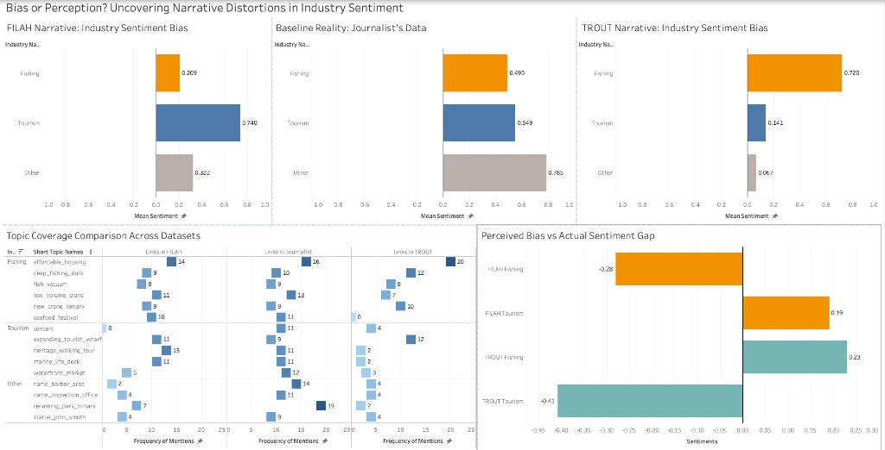
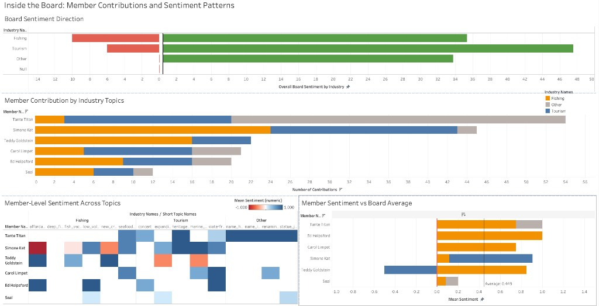
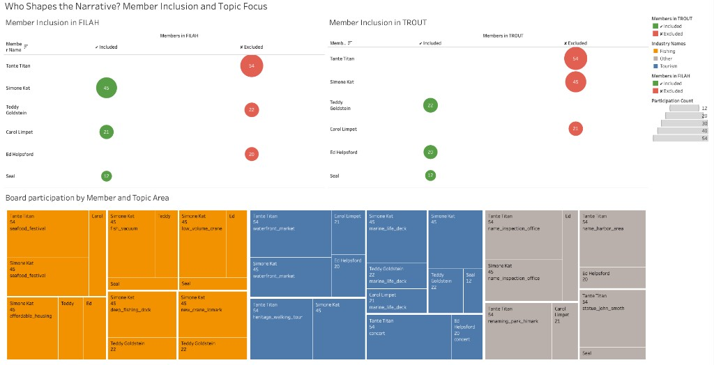
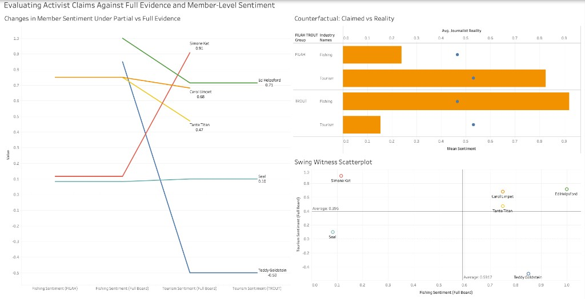
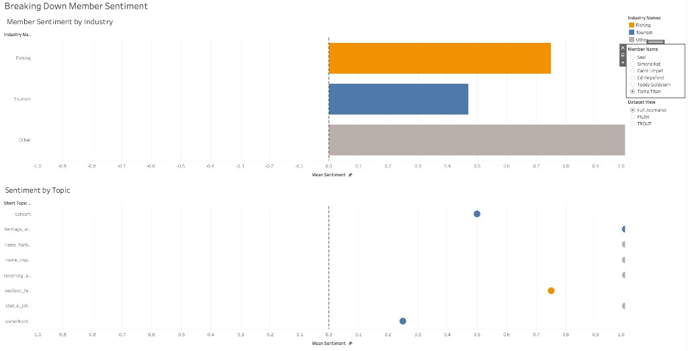
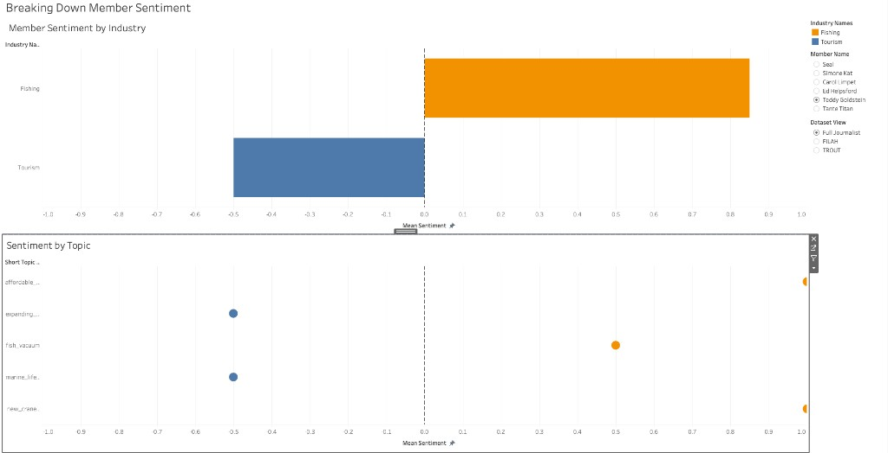
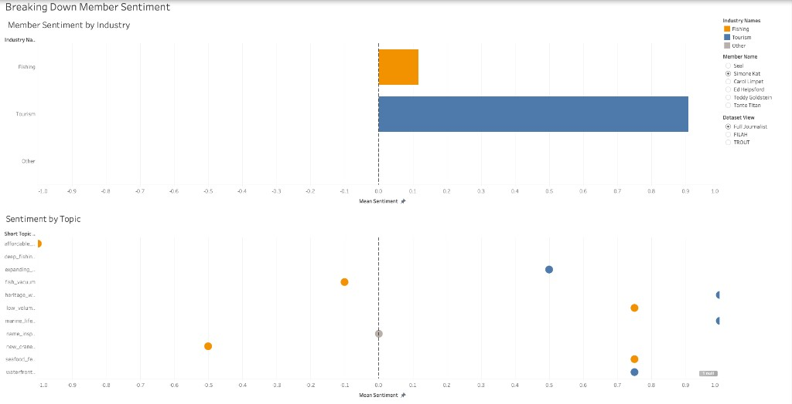
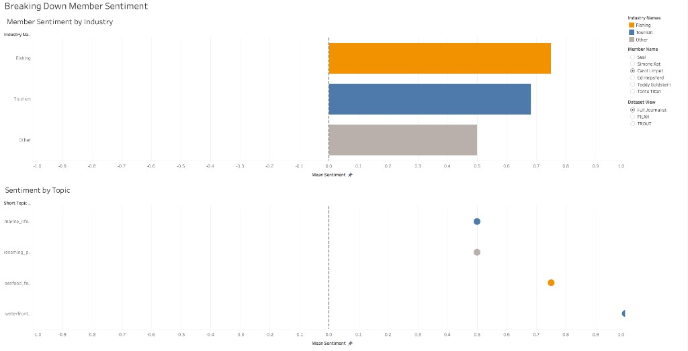
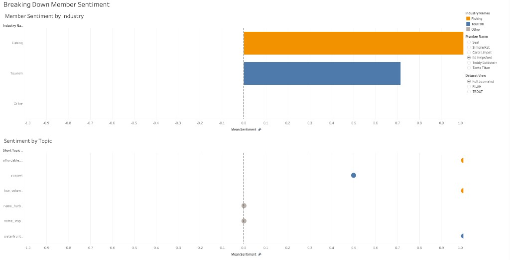
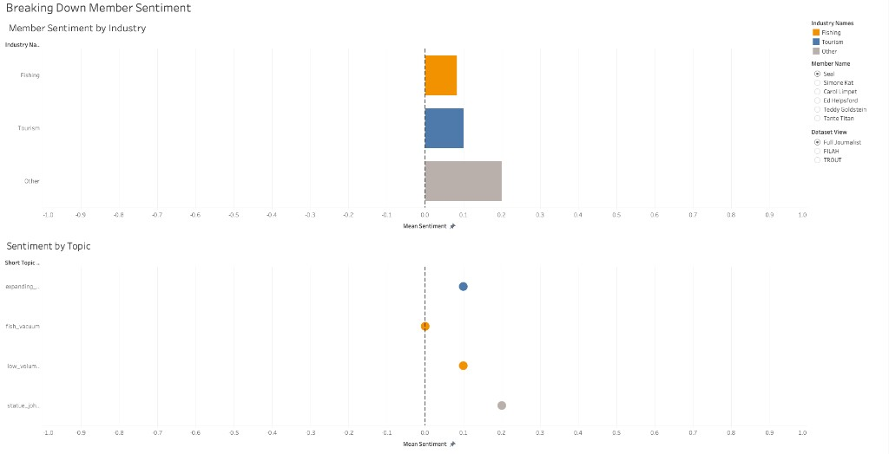

## Overview of Findings

::: {.callout-important appearance="minimal"}
**Central finding:** Neither FILAH's nor TROUT's accusations are fully supported by the complete evidence. Both groups curated their datasets to manufacture a narrative: selecting records that supported their case and quietly omitting those that contradicted it. When viewed through the full journalist dataset, the COOTEFOO board shows near-balanced engagement with both fishing and tourism industries.
:::

What makes this finding analytically interesting is that both groups were working from the same pool of evidence. This was not two independent observers reaching different conclusions. It was two groups with opposing agendas selectively extracting from a shared record.

The most analytically robust finding is not just that both groups cherry-picked, it is that both groups cherry-picked from the same evidence pool and reached opposite conclusions. This is only possible through coordinated, opposing acts of omission: FILAH suppressing every strong pro-fishing voice (Teddy Goldstein, Ed Helpsford, Tante Titan), TROUT suppressing every strong pro-tourism voice (Simone Kat, Carol Limpet, Tante Titan), both working from the journalist's complete record and extracting only what served their respective narratives. The journalist's dataset does not tell a dramatically different story from either partial view, it tells a balanced story that neither partial view was designed to permit.

```{=html}
<div style="display:grid;grid-template-columns:repeat(auto-fit,minmax(160px,1fr));gap:12px;margin:1.5rem 0;">

  <div style="background:#7c5cbf;border-radius:10px;padding:1rem 1.1rem;text-align:center;">
    <div style="font-size:2rem;font-weight:700;color:#fff;line-height:1.1;">60%</div>
    <div style="font-size:0.75rem;color:rgba(255,255,255,0.85);margin-top:4px;line-height:1.4;">of all records hidden by both activist groups combined</div>
  </div>

  <div style="background:#457b9d;border-radius:10px;padding:1rem 1.1rem;text-align:center;">
    <div style="font-size:2rem;font-weight:700;color:#fff;line-height:1.1;">0.059</div>
    <div style="font-size:0.75rem;color:rgba(255,255,255,0.85);margin-top:4px;line-height:1.4;">sentiment gap between Fishing &amp; Tourism in full dataset — not meaningful bias</div>
  </div>

  <div style="background:#2a9d8f;border-radius:10px;padding:1rem 1.1rem;text-align:center;">
    <div style="font-size:2rem;font-weight:700;color:#fff;line-height:1.1;">54</div>
    <div style="font-size:0.75rem;color:rgba(255,255,255,0.85);margin-top:4px;line-height:1.4;">Tante Titan records — excluded by both groups, zero included</div>
  </div>

  <div style="background:#c0392b;border-radius:10px;padding:1rem 1.1rem;text-align:center;">
    <div style="font-size:2rem;font-weight:700;color:#fff;line-height:1.1;">55%</div>
    <div style="font-size:0.75rem;color:rgba(255,255,255,0.85);margin-top:4px;line-height:1.4;">of all tourism links suppressed by TROUT — largest single omission</div>
  </div>

</div>
```


## Q1: Do FILAH's and TROUT's own datasets support their accusations?

::: {.callout-note appearance="minimal"}
**Answer:** Yes, but the support is manufactured through selective inclusion.
:::

### What each group's data shows

When analysed in isolation, both datasets appear to support their respective accusations:

- **FILAH's data** shows board members engaging with Tourism topics at a mean sentiment of **0.740** versus Fishing topics at only **0.209**. This appears to validate FILAH's claim that the board is biased toward tourism.
- **TROUT's data** shows the exact inverse: Fishing sentiment of **0.720** versus Tourism sentiment of only **0.141**. This appears to validate TROUT's claim of pro-fishing bias.

These are not small differences. They look like compelling evidence.

```{=html}
<div class="tableau-embed" style="width:100%; min-height:827px; margin:1rem 0;">
<iframe title="Q1 — Bias or Perception: Narrative Distortions in Industry Sentiment"
  src="https://public.tableau.com/views/NarrativeDistortionsinFILAHTROUTDatasets/BiasorPerceptionUncoveringNarrativeDistortionsinIndustrySentiment?:showVizHome=no&:embed=true&:toolbar=yes"
  width="100%" height="827" style="border:0;"></iframe>
</div>
```
**Figure Q1.1 — Sentiment Overview Dashboard**
<br>1. Sentiment bar chart trellis comparing mean sentiment by industry across FILAH (Fishing=0.209, Tourism=0.740), Journalist (Fishing=0.490, Tourism=0.549), and TROUT (Fishing=0.720, Tourism=0.141)
<br>2. Topic coverage heatmap for mentions per topic across all three datasets; 
<br>3. Accusations vs Reality chart comparing each group's claimed sentiment against the full journalist baseline.

If the interactive embed doesn’t load, open it directly on Tableau Public: [Bias or Perception (Tableau Public)](https://public.tableau.com/app/profile/riona.ng/viz/NarrativeDistortionsinFILAHTROUTDatasets/BiasorPerceptionUncoveringNarrativeDistortionsinIndustrySentiment?publish=yes).

<details>
<summary><strong>View static screenshots</strong></summary>

{width="100%"}

</details>
This dashboard places all three datasets side by side, making the distortions immediately visible by comparing FILAH’s and TROUT’s self-serving narratives against the journalist’s baseline reality.

#### FILAH Narrative: Industry Sentiment Bias

A horizontal bar chart showing mean sentiment by industry using only FILAH’s data. Fishing sits at **0.209** and Tourism at **0.740**: a gap of over 0.5 sentiment points that appears to validate FILAH’s pro-tourism bias claim. The chart has no negative bars, meaning FILAH’s curated records show universally positive board sentiment. The extreme disproportion between the two industry bars is a red flag.

#### Baseline Reality: Journalist’s Data

The same bar chart format applied to the full journalist dataset. Fishing sits at **0.490** and Tourism at **0.549**: a difference of less than 0.06 across the full −1 to +1 scale. The two bars are nearly equal in length. This is the ground truth that both activist groups were working from and chose to distort.

#### TROUT Narrative: Industry Sentiment Bias

TROUT’s version of the same chart produces the mirror image of FILAH’s. Fishing now dominates at **0.720** while Tourism is compressed to **0.141**. The chart is the visual inverse of FILAH’s, which is precisely what you would expect if both groups cherry-picked from the same underlying pool of records.

### The heatmap evidence

The topic coverage heatmap reveals the mechanism behind the distortion. Two topics stand out:

- **FILAH recorded zero links for `concert`**: a Tourism topic, while accusing the board of pro-tourism bias.
- **TROUT recorded zero links for `seafood_festival`**: a Fishing topic, while accusing the board of pro-fishing bias.

Both absences occur at precisely the topic most damaging to each group's respective argument. This pattern is consistent with deliberate editorial selection rather than incomplete data collection, and we treat it as a strong analytical indicator of intentional omission — though, as noted in the Limitations section, we cannot establish this with certainty from the data alone.

### The accusations vs reality

Comparing each group's claimed sentiment values against the full journalist baseline makes the overstatement measurable:

| | Claimed | Reality | Gap |
|:--|:-:|:-:|:-:|
| FILAH Tourism | 0.74 | 0.55 | **+0.19** |
| FILAH Fishing | 0.21 | 0.49 | **−0.28** |
| TROUT Fishing | 0.72 | 0.49 | **+0.23** |
| TROUT Tourism | 0.14 | 0.55 | **−0.41** |

TROUT’s tourism understatement of **−0.41** is the largest single distortion in the comparison and the primary mechanism behind their pro-fishing bias claim.

---

## Q2: Is the COOTEFOO board actually biased?

::: {.callout-note appearance="minimal"}
**Answer:** No. The full dataset shows near-equal engagement with both industries at the board level.
:::

### Board-wide sentiment

Using the complete journalist dataset across all 6 members:

::: {layout-ncol=2}
::: {}
**Fishing**  
Mean sentiment = **0.490**  
33 positive / 6 negative interactions *(participant links only; counts exclude non-participant roles)*
:::
::: {}
**Tourism**  
Mean sentiment = **0.549**  
58 positive / 6 negative interactions
:::
:::

A difference of **0.059** across a −1 to +1 scale does not constitute meaningful bias. Both industries receive positive engagement. The higher raw count for Tourism (58 positive interactions vs 33 for Fishing) reflects participation volume — Tourism topics generated more discussions in the dataset — not directional preference by the board.

The interactive dashboard below uses the full journalist dataset. It includes Board Sentiment Direction (positive vs negative interactions by industry), member participation by industry, the FILAH / Journalist / TROUT sentiment trellis (the Journalist dataset sits between the two partisan extremes), member vs board average bars, and the member × topic sentiment heatmap.

```{=html}
<div class="tableau-embed" style="width:100%; min-height:827px; margin:1rem 0;">
<iframe title="Q2 — Inside the Board: Member Contributions and Sentiment Patterns"
  src="https://public.tableau.com/views/InsidetheBoard/InsidetheBoardMemberContributionsandSentimentPatterns?:showVizHome=no&:embed=true&:toolbar=yes"
  width="100%" height="827" style="border:0;"></iframe>
</div>
```
**Figure Q2.1 — Inside the Board: Member Contributions and Sentiment Patterns (interactive).** Board Sentiment Direction; member participation stacked bars; partisan trellis; member vs board average; member × topic heatmap.

If the interactive embed doesn’t load, open it directly on Tableau Public: [Inside the Board (Tableau Public)](https://public.tableau.com/app/profile/riona.ng/viz/InsidetheBoard/InsidetheBoardMemberContributionsandSentimentPatterns?publish=yes).

<details>
<summary><strong>View static screenshots</strong></summary>

{width="100%"}

</details>

### Inside the Board: Member Contributions and Sentiment Patterns

This dashboard uses the full journalist dataset to examine what the board actually does, how members distribute their participation across industries and whether sentiment patterns suggest any systematic lean.

#### Board Sentiment Direction

A diverging bar chart showing the net count of positive versus negative board interactions by industry, using the full journalist dataset. Green bars extend right (positive interactions), red bars extend left (negative interactions). Fishing shows roughly 33 positive against 6 negative (participant links); Tourism shows roughly 45 positive against 6 negative; Other shows a similar positive-dominant profile. The green bars dominate across all three industry categories — the board as a whole engages positively with both Fishing and Tourism, with no meaningful directional imbalance.

#### Member Contribution by Industry Topics

A stacked horizontal bar chart showing each member’s total participation link count, broken down by industry (Fishing = orange, Tourism = blue, Other = grey). Members are sorted by total contribution count. Tante Titan and Simone Kat are the two highest contributors overall. Teddy Goldstein’s bar is exclusively Fishing, a visually distinctive profile explained by his TROUT-only presence. Seal has the lowest total count across all members.

#### Member-Level Sentiment Across Topics

A heatmap with members as rows and individual topics as columns, grouped by industry. Cell colour encodes mean sentiment on a red (−1) to blue (+1) scale. The blank cells indicate a member has no recorded participation in that topic under the current dataset view.

#### Member Sentiment vs Board Average

A horizontal bar chart showing each member’s mean sentiment per industry (Fishing = orange, Tourism = blue, Other = grey), plotted against a vertical reference line marking the board-wide average. The most notable departure is Teddy Goldstein’s tourism bar, which extends left to **−0.50** — the only negative industry-level value on the entire chart. The individual variation is real, but it is variation between members, not a board-level lean. The vertical reference line in Tableau reflects that workbook’s aggregation (it can read near **0.449** in the viz); it is not the same as a flat mean across every participant-link sentiment row in the raw CSVs (**≈0.597**) or a simple mean of each member’s per-industry means (**≈0.62**). Use the line as the dashboard’s board-wide benchmark, not as an unweighted CSV summary statistic.

---

### Member-level variation exists

Individual members do show different industry orientations:

| Member | Fishing sentiment | Tourism sentiment | Profile |
|:--|:-:|:-:|:--|
| Tante Titan | 0.75 | 0.47 | Broadly positive across both |
| Ed Helpsford | 1.00 | 0.71 | Fishing-positive, tourism-positive |
| Carol Limpet | 0.75† | 0.68 | Tourism-leaning; fishing via `seafood_festival` |
| Simone Kat | 0.38‡ | 0.91 | Strongly tourism-leaning |
| Teddy Goldstein | 0.85 | **−0.50** | Only member with negative industry sentiment |
| Seal | 0.20 | 0.20 | Low but balanced |

*† Five fishing participation links on `seafood_festival` in the raw CSVs (sentiment 0.75 each); mean **0.75**.*  
*‡ **0.38** is the flat mean across Simone Kat’s fishing participant links in the raw CSVs; Tableau’s member-level fishing mark may differ (e.g. **0.12**) depending on aggregation.*

The individual variation is real, but it is variation **between members**, not a board-level lean.

Seal occupies a distinct analytical position. With 12 participant records in the journalist dataset, Seal is fully present in both FILAH's dataset (12 records) and TROUT's (12 records), the only member included without suppression by either group. His consistently low sentiment across both industries is not an artefact of selective inclusion; it is stable across all three dataset views. Seal appears to be a genuinely low-engagement member rather than a partisan one, and his profile does not shift when the fuller evidence is introduced. This makes him the one board member neither group had a strong reason to suppress or highlight.

---

## Q3: Are the accusations weakened by the full dataset?

::: {.callout-note appearance="minimal"}
**Answer:** Yes, substantially, for both groups.
:::

### Who Shapes the Narrative? Member Inclusion and Topic Focus

This dashboard reveals the editorial decisions each group made: which members they included, which they excluded, and which topics each included member dominated.

```{=html}
<div class="tableau-embed" style="width:100%; min-height:827px; margin:1rem 0;">
<iframe title="Q3 — Who Shapes the Narrative: Member Inclusion and Topic Focus"
  src="https://public.tableau.com/views/WhoShapestheNarrative/WhoShapestheNarrativeMemberInclusionandTopicFocus?:showVizHome=no&:embed=true&:toolbar=yes"
  width="100%" height="827" style="border:0;"></iframe>
</div>
```

**Figure Q3.1 — Who Shapes the Narrative: Member Inclusion and Topic Focus (interactive).** Member inclusion views for FILAH and TROUT, topic focus treemap, and related views showing which records each group chose to include or exclude.

If the interactive embed doesn’t load, open it directly on Tableau Public: [Who Shapes the Narrative? (Tableau Public)](https://public.tableau.com/app/profile/riona.ng/viz/WhoShapestheNarrative/WhoShapestheNarrativeMemberInclusionandTopicFocus?publish=yes).

<details>
<summary><strong>View static screenshots (fallback)</strong></summary>

{width="100%"}

</details>

#### Member Inclusion in FILAH

A bubble chart with members as rows and two columns: Included (green bubbles) and Excluded (red bubbles). Bubble size encodes participation count. Tante Titan (54 records), Teddy Goldstein (22 records), and Ed Helpsford (20 records) appear as large red bubbles in the Excluded column, they were entirely omitted from FILAH’s dataset. The excluded members are precisely the three with the highest pro-fishing sentiment scores in the full dataset.

#### Member Inclusion in TROUT

The mirror-image bubble chart for TROUT. Here Tante Titan (54), Simone Kat (45), and Carol Limpet (21) appear as large red excluded bubbles. Teddy Goldstein (22), Ed Helpsford (20), and Seal (12) are included. The symmetry between the two charts: each group excluded precisely the members whose records would have moderated their claimed bias.

::: {.callout-important appearance="minimal"}
**Tante Titan: 54 records — excluded by both groups. She contradicts both narratives.**

She has more participation records than any other board member. Her sentiment is broadly positive across fishing (0.75), tourism (0.47), and other topics (1.00). Neither FILAH nor TROUT included a single one of her records — she is too balanced to support either group's claim of bias. Her absence is not a data gap. It is the most deliberate editorial decision in the entire dataset.
:::

#### Board Participation by Member and Topic Area

A treemap segmented by industry colour (Fishing = orange, Tourism = blue, Other = grey), where each tile represents a member–topic pairing sized by participation count. The largest tiles are Tante Titan × `seafood_festival` / `waterfront_market`, and Simone Kat × `fish_vacuum` / `heritage_walking_tour`.

This represents the fairness in the amount of meetings mentioning either fishing or tourism based on the size of the treemap tiles. 

### What changed and why

The sentiment scores for individual members do not change between datasets. What changes is **who is present** and **what topics are covered**, and this shifts the overall picture dramatically.

::: {layout-ncol=2}
::: {}
**FILAH excluded:**  
Teddy Goldstein (Fishing=0.85)  
Ed Helpsford (Fishing=1.0, Tourism=0.71)  
Tante Titan (Fishing=0.75)  

These three are precisely the strongest pro-fishing members. Their absence drove FILAH's fishing average down to 0.209.
:::
::: {}
**TROUT excluded:**  
Simone Kat (Tourism=0.91)  
Carol Limpet (Tourism=0.68)  
Tante Titan (Tourism=0.47)  

These three are precisely the strongest pro-tourism members. Their absence drove TROUT's tourism average down to 0.141.
:::
:::

### The suppressed numbers

| | Missing from FILAH | Missing from TROUT |
|:--|:-:|:-:|
| Fishing participation links | 28 | 32 |
| Tourism participation links | 30 | **47** |
| Other participation links | 38 | 41 |

*Note: Industry classification (Fishing / Tourism / Other) is derived from topic names in the Tableau data model, not from a raw industry field in the source CSVs. The `industry` column in all three links files is null in the raw data. These figures reflect the topic-based industry classification applied consistently across all datasets in Tableau.*

::: {.callout-warning appearance="minimal"}
TROUT suppressed **47 tourism-classified participation links** — more than any other category from either organisation. That is **55% of all tourism participation links** in the full journalist dataset, removed by a single group in a single category.
:::

::: {.callout-warning appearance="minimal"}
**TROUT travel records: 4 of 22 — near-total suppression of geographic evidence.**

The full journalist dataset contains 22 travel links. FILAH recorded 15 of them. TROUT recorded only 4 — an 82% omission rate. The geographic dimension of board member activity was almost entirely removed from TROUT's submission.
:::


```{=html}
<div style="background:#457b9d;border-radius:8px;padding:1rem 1.25rem;margin:1.25rem 0;">
  <div style="display:inline-block;background:rgba(255,255,255,0.25);color:#fff;font-family:'DM Sans',sans-serif;font-size:0.68rem;font-weight:600;letter-spacing:0.08em;text-transform:uppercase;padding:2px 10px;border-radius:20px;margin-bottom:0.6rem;">Verdict on TROUT</div>
  <p style="margin:0;color:#fff;font-family:'DM Sans',sans-serif;font-size:0.92rem;line-height:1.7;">TROUT's accusations are substantially weakened by the full dataset. The appearance of pro-fishing board bias in TROUT's data is manufactured almost entirely by the suppression of Simone Kat (45 journalist records, 0 in TROUT), Carol Limpet (21 journalist records, 0 in TROUT), and Tante Titan (54 journalist records, 0 in TROUT). These three members account for the board's most pro-tourism engagement. Removing them collapses TROUT's tourism average to 0.141. In the full journalist dataset, tourism sentiment rises to 0.549, nearly four times higher. The accusation is not strengthened or unchanged; it is directly contradicted by the evidence TROUT chose not to show.</p>
</div>
```

```{=html}
<div style="background:#c0392b;border-radius:8px;padding:1rem 1.25rem;margin:1.25rem 0;">
  <div style="display:inline-block;background:rgba(255,255,255,0.25);color:#fff;font-family:'DM Sans',sans-serif;font-size:0.68rem;font-weight:600;letter-spacing:0.08em;text-transform:uppercase;padding:2px 10px;border-radius:20px;margin-bottom:0.6rem;">Verdict on FILAH</div>
  <p style="margin:0;color:#fff;font-family:'DM Sans',sans-serif;font-size:0.92rem;line-height:1.7;">Ed Helpsford's exclusion from FILAH is analytically significant. He contributes 20 participant records in the full journalist dataset, none of which appear in FILAH's submission. His fishing sentiment in the full dataset is the highest of any board member, and removing him directly lowers the average fishing sentiment in FILAH's dataset, which is precisely what their narrative required. TROUT, by contrast, included all 20 of his records, surfacing exactly the evidence that served their case.</p>
</div>
```

### Evaluating activist claims against full evidence 

```{=html}
<div class="tableau-embed" style="width:100%; min-height:827px; margin:1rem 0;">
<iframe title="Q3 — Evaluating Activist Claims Against Full Evidence and Member-Level Sentiment"
  src="https://public.tableau.com/views/EvaluatingActivistClaims/EvaluatingActivistClaimsAgainstFullEvidenceandMember-LevelSentiment?:showVizHome=no&:embed=true&:toolbar=yes"
  width="100%" height="827" style="border:0;"></iframe>
</div>
```
**Figure Q3.2 — Evaluating Activist Claims Against Full Evidence and Member-Level Sentiment** Slopegraph, claimed-vs-reality bullet chart, and swing-witness scatterplot comparing each group's framing to the full journalist record.

If the interactive embed doesn’t load, open it directly on Tableau Public: [Evaluating Activist Claims (Tableau Public)](https://public.tableau.com/app/profile/riona.ng/viz/EvaluatingActivistClaims/EvaluatingActivistClaimsAgainstFullEvidenceandMember-LevelSentiment?publish=yes).

<details>
<summary><strong>View static screenshots (fallback)</strong></summary>

{width="100%"}

</details>

This dashboard directly confronts the gap between what each group claimed and what the full record shows, using three charts that together move from individual trajectories to group-level overstatement to a spatial summary of who was useful to whom.

#### Changes in Member Sentiment Under Partial vs Full Evidence

A slopegraph tracing each board member’s sentiment value across four vantage points: Fishing Sentiment (FILAH), Fishing Sentiment (Full Board), Tourism Sentiment (Full Board), and Tourism Sentiment (TROUT). 

The most obvious omission is Teddy Goldstein: he is absent from FILAH, then appears as strongly pro-fishing (~0.85) in the full board view, and ends at **−0.50** for tourism under TROUT, the only negative endpoint. Simone Kat runs in the opposite direction, ending at **0.91** for tourism in the full board view — a value TROUT suppressed by excluding her.

::: {.callout-warning appearance="minimal"}
**Teddy Goldstein: the sharpest sentiment swing in the dataset.**

In TROUT's partial view his tourism sentiment reads as approximately +0.10. When the full journalist evidence is applied it collapses to **−0.50** — the only negative industry sentiment score on the entire board, and a swing of 0.60 points. Partial evidence does not just obscure his profile. It inverts it. This is why FILAH excluded him: his numbers, in full context, contradict their narrative entirely.
:::

#### Counterfactual: Claimed vs Reality

A bullet graph with four rows, FILAH × Fishing, FILAH × Tourism, TROUT × Fishing, TROUT × Tourism: where each row shows the group’s claimed sentiment and the full journalist reality. TROUT’s Tourism understatement (~**−0.41**) is the largest single distortion.

#### Swing Witness Scatterplot

A scatterplot of Fishing Sentiment (Full Board) vs Tourism Sentiment (Full Board) with reference lines at Fishing = **0.5917** and Tourism = **0.396**. Tante Titan sits near the middle (balanced and high volume), Simone Kat is the tourism outlier, and Teddy Goldstein is the only member with negative tourism sentiment.


## Q4: How does an individual member's story change across datasets?

::: {.callout-note appearance="minimal"}
**Answer:** Dramatically. The same person can look like a partisan, a moderate, or simply not exist, depending on whose dataset you use.
:::

The interactive dashboard below makes this visible: members absent from a dataset simply do not appear in that panel. **The missing rows are the story.**

```{=html}
<div class="tableau-embed" style="width:100%; min-height:827px; margin:1rem 0;">
<iframe title="Q4 — Breaking Down Member Sentiment"
  src="https://public.tableau.com/views/BreakingDownIndividualBoardMemberSentiments/BreakingDownMemberSentiment?:showVizHome=no&:embed=true&:toolbar=yes"
  width="100%" height="827" style="border:0;"></iframe>
</div>
```
**Figure Q4.1: Breaking Down Member Sentiment** Use the member and dataset filters to compare industry-level bars and topic-level dots across FILAH, TROUT, and the full journalist record.


If the interactive embed doesn’t load, open it directly on Tableau Public: [Breaking Down Member Sentiment (Tableau Public)](https://public.tableau.com/app/profile/riona.ng/viz/BreakingDownIndividualBoardMemberSentiments/BreakingDownMemberSentiment?publish=yes).

<details>
<summary><strong>View static screenshots</strong></summary>

**Member views**

{width="100%"}
{width="100%"}
{width="100%"}
{width="100%"}
{width="100%"}
{width="100%"}

</details>

### Breaking Down Member Sentiment

This dashboard is designed to explore any individual member’s profile interactively — selecting a name and toggling the dataset view to see how the story changes. The two views work together: the upper view gives the industry-level summary, and the lower view gives the topic-level detail.

#### Member Sentiment by Industry

A horizontal bar chart showing the selected member’s mean sentiment broken down by industry (Fishing / Tourism / Other), plotted on a −1 to +1 scale with a dashed zero-line as reference. It responds to two filter controls: **Member Name** and **Dataset View** (Full Journalist / FILAH / TROUT).

When **Tante Titan** is selected under **Full Journalist** view, the bars show a broadly positive, balanced profile. Switching Dataset View to FILAH or TROUT collapses the chart to empty because neither group recorded any of her 54 links. **The absence of bars is itself the evidence.**

#### Sentiment by Topic

A dot plot beneath the industry view that breaks the same selection down to individual topic level. Each row is a topic; each dot is the member’s mean sentiment on that topic, coloured by industry. Switching from Full Journalist to FILAH or TROUT makes missing participation visually explicit: dots (and sometimes entire topic rows) disappear because the underlying records were suppressed.


## Network Graph: Board Member Connections

The network below makes the suppression pattern visible spatially — switch between dataset filters to watch members appear and disappear, and click any board member to see their topic connections and sentiment scores.

This interactive network maps each board member's participation across discussions and travel records. Node size reflects total connection count. Edge colour reflects which dataset the connection comes from — FILAH edges, TROUT edges, journalist-only edges, and edges shared by both groups are each coloured distinctly.

When exploring the network, three observations are analytically important. First, switch to the **FILAH-only filter**: Tante Titan's node disappears entirely, despite her being the most connected member in the full journalist view. Second, apply the **TROUT-only filter**: Simone Kat and Carol Limpet's nodes vanish completely, and Tante Titan also disappears. Third, in the **full journalist view**, Teddy Goldstein appears as a moderately connected member rather than a dominant hub — which contextualises how misleading TROUT's partial framing of him is. The missing nodes are not a display artefact. They are the story.


```{=html}
<style>
#gnet-wrap {
  border: 1px solid #e2ddf0;
  border-radius: 10px;
  background: #f7f6fb;
  position: relative;
  overflow: hidden;
  height: 480px;
}
.gnet-btn {
  padding: 5px 14px;
  border: 1px solid #c8bfe8;
  border-radius: 20px;
  background: #fff;
  color: #6b6b80;
  font-family: 'DM Sans', sans-serif;
  font-size: 0.78rem;
  cursor: pointer;
  transition: all .15s;
}
.gnet-btn:hover { background: #ede8f7; color: #4e3780; }
.gnet-btn.active { background: #7c5cbf; color: #fff; border-color: #7c5cbf; }
#gnet-tooltip {
  position: absolute; display: none;
  background: #fff; border: 1px solid #e2ddf0;
  border-radius: 10px; padding: 11px 14px;
  font-size: 0.78rem; max-width: 215px;
  pointer-events: none; z-index: 10; line-height: 1.65;
  font-family: 'DM Sans', sans-serif;
  box-shadow: 0 2px 12px rgba(124,92,191,0.08);
}
#gnet-tooltip .tt-name { font-weight: 600; font-size: 0.85rem; color: #1a1a2e; margin-bottom: 4px; }
#gnet-tooltip .tt-row { color: #6b6b80; }
#gnet-tooltip .tt-row span { color: #1a1a2e; font-weight: 500; }
#gnet-panel {
  display: none; position: absolute; top: 12px; right: 12px;
  width: 190px; background: #fff; border: 1px solid #e2ddf0;
  border-radius: 10px; padding: 13px;
  font-size: 0.75rem; font-family: 'DM Sans', sans-serif;
  box-shadow: 0 2px 12px rgba(124,92,191,0.08); z-index: 5;
}
.gnet-stat-cards {
  display: grid; grid-template-columns: repeat(auto-fit, minmax(140px, 1fr));
  gap: 8px; margin-top: 14px;
}
.gnet-card { padding: 9px 11px; border-radius: 10px; background: #f7f6fb; border: 1px solid #e2ddf0; font-family: 'DM Sans', sans-serif; }
.gnet-card-label { font-size: 0.7rem; font-weight: 500; color: #6b6b80; }
.gnet-card-value { font-size: 0.8rem; color: #1a1a2e; margin-top: 1px; }
.gnet-card-note  { font-size: 0.7rem; margin-top: 2px; }
</style>

<div style="display:flex;align-items:center;gap:8px;flex-wrap:wrap;margin-bottom:10px">
  <button class="gnet-btn active" data-f="all">All datasets</button>
  <button class="gnet-btn" data-f="FILAH">FILAH only</button>
  <button class="gnet-btn" data-f="TROUT">TROUT only</button>
  <button class="gnet-btn" data-f="Journalist Only">Journalist only</button>
  <button class="gnet-btn" data-f="FILAH+TROUT">FILAH + TROUT</button>
  <span id="gnet-count" style="margin-left:auto;font-size:0.75rem;color:#6b6b80;font-family:'DM Sans',sans-serif"></span>
</div>

<div style="display:flex;gap:14px;flex-wrap:wrap;margin-bottom:9px;font-size:0.75rem;color:#6b6b80;font-family:'DM Sans',sans-serif;align-items:center">
  <span><svg width="11" height="11" style="vertical-align:middle;margin-right:3px"><circle cx="5.5" cy="5.5" r="5.5" fill="#e63946"/></svg>Board member</span>
  <span><svg width="11" height="9" style="vertical-align:middle;margin-right:3px"><rect width="11" height="9" rx="2" fill="#e9a900"/></svg>Fishing topic</span>
  <span><svg width="11" height="9" style="vertical-align:middle;margin-right:3px"><rect width="11" height="9" rx="2" fill="#457b9d"/></svg>Tourism topic</span>
  <span><svg width="11" height="9" style="vertical-align:middle;margin-right:3px"><rect width="11" height="9" rx="2" fill="#888"/></svg>Other topic</span>
  <span style="margin-left:4px">
    Edges:&nbsp;
    <svg width="16" height="3" style="vertical-align:middle;margin-right:2px"><line x1="0" y1="1.5" x2="16" y2="1.5" stroke="#e63946" stroke-width="2"/></svg>FILAH&nbsp;
    <svg width="16" height="3" style="vertical-align:middle;margin:0 3px"><line x1="0" y1="1.5" x2="16" y2="1.5" stroke="#457b9d" stroke-width="2"/></svg>TROUT&nbsp;
    <svg width="16" height="3" style="vertical-align:middle;margin:0 3px"><line x1="0" y1="1.5" x2="16" y2="1.5" stroke="#2a9d8f" stroke-width="2"/></svg>Journalist only&nbsp;
    <svg width="16" height="3" style="vertical-align:middle;margin:0 3px"><line x1="0" y1="1.5" x2="16" y2="1.5" stroke="#7c5cbf" stroke-width="2"/></svg>Both
    &nbsp;&middot; thickness = sentiment strength
  </span>
</div>

<div id="gnet-wrap">
  <svg id="gnet-svg" style="width:100%;height:100%"></svg>
  <div id="gnet-tooltip"></div>
  <div id="gnet-panel"></div>
</div>
<p style="font-size:0.72rem;color:#6b6b80;margin-top:5px;font-family:'DM Sans',sans-serif">
  Drag nodes &middot; scroll to zoom &middot; <strong>click a board member (red)</strong> to highlight their connections and see sentiment scores
</p>

<div class="gnet-stat-cards">
  <div class="gnet-card" style="border-color:#2a9d8f55">
    <div class="gnet-card-label">Tante Titan</div>
    <div class="gnet-card-value">26 topic connections</div>
    <div class="gnet-card-note" style="color:#2a9d8f">Excluded by BOTH groups</div>
  </div>
  <div class="gnet-card" style="border-color:#e6394655">
    <div class="gnet-card-label">Teddy Goldstein</div>
    <div class="gnet-card-value">12 connections — TROUT</div>
    <div class="gnet-card-note" style="color:#c0392b">Hidden by FILAH</div>
  </div>
  <div class="gnet-card" style="border-color:#457b9d55">
    <div class="gnet-card-label">Simone Kat</div>
    <div class="gnet-card-value">23 connections — FILAH</div>
    <div class="gnet-card-note" style="color:#457b9d">Hidden by TROUT</div>
  </div>
  <div class="gnet-card" style="border-color:#7c5cbf55">
    <div class="gnet-card-label">Seal</div>
    <div class="gnet-card-value">7 connections</div>
    <div class="gnet-card-note" style="color:#7c5cbf">Accepted by both</div>
  </div>
</div>

<script src="https://cdnjs.cloudflare.com/ajax/libs/d3/7.8.5/d3.min.js"></script>
<script>
(function() {
var TOPIC_LABELS = {
  concert:"Concert", new_crane_lomark:"New Crane Lomark", deep_fishing_dock:"Deep Fishing Dock",
  waterfront_market:"Waterfront Market", name_inspection_office:"Inspection Office",
  name_harbor_area:"Name Harbor Area", renaming_park_himark:"Renaming Park",
  statue_john_smoth:"Statue J. Smoth", heritage_walking_tour:"Heritage Walk",
  low_volume_crane:"Low Volume Crane", seafood_festival:"Seafood Festival",
  marine_life_deck:"Marine Life Deck", fish_vacuum:"Fish Vacuum",
  affordable_housing:"Affordable Housing", expanding_tourist_wharf:"Tourist Wharf"
};
var MEMBER_DATA = {
  "Tante Titan":    {ds:"Journalist Only", fish:0.75, tour:0.47, note:"Excluded by BOTH groups — 54 raw participation records, zero in FILAH or TROUT."},
  "Teddy Goldstein":{ds:"TROUT",           fish:0.85, tour:-0.50, note:"Hidden by FILAH entirely. Tourism sentiment -0.50 — the only negative industry score on the board."},
  "Simone Kat":     {ds:"FILAH",           fish:0.12, tour:0.91, note:"Hidden by TROUT. Tourism sentiment 0.91 — highest on the board."},
  "Carol Limpet":   {ds:"FILAH",           fish:0.75, tour:0.83, note:"FILAH only — tourism-leaning across marine life and waterfront topics."},
  "Ed Helpsford":   {ds:"TROUT",           fish:1.00, tour:0.75, note:"TROUT only — fishing sentiment 1.00, the maximum possible."},
  "Seal":           {ds:"FILAH+TROUT",     fish:0.10, tour:0.10, note:"Accepted by both groups — low but balanced sentiment across industries."}
};
var DS_COL = {"FILAH":"#e63946","TROUT":"#457b9d","Journalist Only":"#2a9d8f","FILAH+TROUT":"#7c5cbf"};
var IND_COL = {Fishing:"#e9a900", Tourism:"#457b9d", Other:"#888"};
var RAW_EDGES = [
  {m:"Carol Limpet",   t:"marine_life_deck",       ds:"FILAH",          ind:"Tourism",  s:0.50, n:4},
  {m:"Carol Limpet",   t:"renaming_park_himark",   ds:"FILAH",          ind:"Other",    s:0.50, n:3},
  {m:"Carol Limpet",   t:"seafood_festival",        ds:"FILAH",          ind:"Fishing",  s:0.75, n:4},
  {m:"Carol Limpet",   t:"waterfront_market",       ds:"FILAH",          ind:"Tourism",  s:1.00, n:3},
  {m:"Ed Helpsford",   t:"affordable_housing",      ds:"TROUT",          ind:"Fishing",  s:1.00, n:4},
  {m:"Ed Helpsford",   t:"concert",                 ds:"TROUT",          ind:"Tourism",  s:0.50, n:2},
  {m:"Ed Helpsford",   t:"low_volume_crane",        ds:"TROUT",          ind:"Fishing",  s:1.00, n:1},
  {m:"Ed Helpsford",   t:"name_harbor_area",        ds:"TROUT",          ind:"Other",    s:0.00, n:1},
  {m:"Ed Helpsford",   t:"name_inspection_office",  ds:"TROUT",          ind:"Other",    s:0.00, n:1},
  {m:"Ed Helpsford",   t:"waterfront_market",       ds:"TROUT",          ind:"Tourism",  s:1.00, n:2},
  {m:"Seal",           t:"expanding_tourist_wharf", ds:"FILAH+TROUT",    ind:"Tourism",  s:0.10, n:3},
  {m:"Seal",           t:"low_volume_crane",        ds:"FILAH+TROUT",    ind:"Fishing",  s:0.10, n:3},
  {m:"Seal",           t:"statue_john_smoth",       ds:"FILAH+TROUT",    ind:"Other",    s:0.20, n:1},
  {m:"Simone Kat",     t:"affordable_housing",      ds:"FILAH",          ind:"Fishing",  s:-1.00,n:2},
  {m:"Simone Kat",     t:"expanding_tourist_wharf", ds:"FILAH",          ind:"Tourism",  s:0.50, n:2},
  {m:"Simone Kat",     t:"fish_vacuum",             ds:"FILAH",          ind:"Fishing",  s:-0.10,n:2},
  {m:"Simone Kat",     t:"heritage_walking_tour",   ds:"FILAH",          ind:"Tourism",  s:1.00, n:6},
  {m:"Simone Kat",     t:"low_volume_crane",        ds:"FILAH",          ind:"Fishing",  s:0.75, n:4},
  {m:"Simone Kat",     t:"marine_life_deck",        ds:"FILAH",          ind:"Tourism",  s:1.00, n:2},
  {m:"Simone Kat",     t:"name_inspection_office",  ds:"FILAH",          ind:"Other",    s:0.00, n:2},
  {m:"Simone Kat",     t:"new_crane_lomark",        ds:"FILAH",          ind:"Fishing",  s:-0.50,n:2},
  {m:"Simone Kat",     t:"seafood_festival",        ds:"FILAH",          ind:"Fishing",  s:0.75, n:2},
  {m:"Simone Kat",     t:"waterfront_market",       ds:"FILAH",          ind:"Tourism",  s:0.75, n:1},
  {m:"Tante Titan",    t:"concert",                 ds:"Journalist Only",ind:"Tourism",  s:0.50, n:5},
  {m:"Tante Titan",    t:"heritage_walking_tour",   ds:"Journalist Only",ind:"Tourism",  s:1.00, n:1},
  {m:"Tante Titan",    t:"name_harbor_area",        ds:"Journalist Only",ind:"Other",    s:1.00, n:4},
  {m:"Tante Titan",    t:"name_inspection_office",  ds:"Journalist Only",ind:"Other",    s:1.00, n:2},
  {m:"Tante Titan",    t:"renaming_park_himark",    ds:"Journalist Only",ind:"Other",    s:1.00, n:8},
  {m:"Tante Titan",    t:"seafood_festival",        ds:"Journalist Only",ind:"Fishing",  s:0.75, n:1},
  {m:"Tante Titan",    t:"statue_john_smoth",       ds:"Journalist Only",ind:"Other",    s:1.00, n:4},
  {m:"Tante Titan",    t:"waterfront_market",       ds:"Journalist Only",ind:"Tourism",  s:0.25, n:3},
  {m:"Teddy Goldstein",t:"affordable_housing",      ds:"TROUT",          ind:"Fishing",  s:1.00, n:2},
  {m:"Teddy Goldstein",t:"expanding_tourist_wharf", ds:"TROUT",          ind:"Tourism",  s:-0.50,n:3},
  {m:"Teddy Goldstein",t:"fish_vacuum",             ds:"TROUT",          ind:"Fishing",  s:0.50, n:2},
  {m:"Teddy Goldstein",t:"marine_life_deck",        ds:"TROUT",          ind:"Tourism",  s:-0.50,n:1},
  {m:"Teddy Goldstein",t:"new_crane_lomark",        ds:"TROUT",          ind:"Fishing",  s:1.00, n:2}
];

function dsColor(ds) { return DS_COL[ds] || "#888"; }

function buildGraph(filter) {
  var svgEl = d3.select("#gnet-svg");
  svgEl.selectAll("*").remove();
  var wrap = document.getElementById("gnet-wrap");
  var W = wrap.clientWidth || 640, H = 480, PAD = 26;

  var edges = filter ? RAW_EDGES.filter(function(e){ return e.ds === filter; }) : RAW_EDGES;
  document.getElementById("gnet-count").textContent = edges.length + " topic connections shown";

  var memberSet = new Set(Object.keys(MEMBER_DATA));
  var topicSet  = new Set(edges.map(function(e){ return e.t; }));
  var degMap    = {};
  edges.forEach(function(e){ degMap[e.m]=(degMap[e.m]||0)+e.n; degMap[e.t]=(degMap[e.t]||0)+e.n; });

  var nodes=[], nodeMap={};
  memberSet.forEach(function(m){ var n={id:m,type:"member",ind:"",label:m.split(" ")[0]}; nodes.push(n); nodeMap[m]=n; });
  topicSet.forEach(function(t){
    if(nodeMap[t]) return;
    var ind=(edges.find(function(e){ return e.t===t; })||{}).ind||"Other";
    var n={id:t,type:"topic",ind:ind,label:TOPIC_LABELS[t]||t};
    nodes.push(n); nodeMap[t]=n;
  });
  var links = edges.map(function(e){ return {source:e.m,target:e.t,ds:e.ds,s:e.s,n:e.n}; });

  var g = svgEl.attr("viewBox","0 0 "+W+" "+H).append("g");
  svgEl.call(d3.zoom().scaleExtent([0.35,3]).on("zoom",function(event){ g.attr("transform",event.transform); }));
  svgEl.on("click",function(event){
    if(event.target===svgEl.node()){ selectedMember=null; resetHL(); document.getElementById("gnet-panel").style.display="none"; }
  });

  var sim = d3.forceSimulation(nodes)
    .force("link",d3.forceLink(links).id(function(d){return d.id;}).distance(72).strength(0.75))
    .force("charge",d3.forceManyBody().strength(function(d){return d.type==="member"?-190:-75;}))
    .force("center",d3.forceCenter(W/2,H/2).strength(0.1))
    .force("x",d3.forceX(W/2).strength(0.06))
    .force("y",d3.forceY(H/2).strength(0.06))
    .force("collision",d3.forceCollide().radius(function(d){return d.type==="member"?22:10;}).strength(0.9));

  sim.on("tick",function(){
    nodes.forEach(function(d){ d.x=Math.max(PAD,Math.min(W-PAD,d.x)); d.y=Math.max(PAD,Math.min(H-PAD,d.y)); });
    link.attr("x1",function(d){return d.source.x;}).attr("y1",function(d){return d.source.y;})
        .attr("x2",function(d){return d.target.x;}).attr("y2",function(d){return d.target.y;});
    node.attr("cx",function(d){return d.x;}).attr("cy",function(d){return d.y;});
    mlabel.attr("x",function(d){return d.x;}).attr("y",function(d){return d.y+4;});
    tlabel.attr("x",function(d){return d.x;}).attr("y",function(d){return d.y-11;});
  });

  var link = g.append("g").selectAll("line").data(links).join("line")
    .attr("stroke",function(d){return dsColor(d.ds);})
    .attr("stroke-opacity",0.55)
    .attr("stroke-width",function(d){return Math.max(0.8,1+Math.abs(d.s||0)*2);});

  var node = g.append("g").selectAll("circle").data(nodes).join("circle")
    .attr("r",function(d){return d.type==="member"?16+Math.sqrt(degMap[d.id]||0):6+Math.sqrt(degMap[d.id]||0)*0.7;})
    .attr("fill",function(d){return d.type==="member"?"#e63946":(IND_COL[d.ind]||"#888");})
    .attr("stroke",function(d){return d.type==="member"?"#fff":"none";})
    .attr("stroke-width",2)
    .style("cursor",function(d){return d.type==="member"?"pointer":"default";})
    .call(d3.drag()
      .on("start",function(event,d){if(!event.active)sim.alphaTarget(0.3).restart();d.fx=d.x;d.fy=d.y;})
      .on("drag",function(event,d){d.fx=Math.max(PAD,Math.min(W-PAD,event.x));d.fy=Math.max(PAD,Math.min(H-PAD,event.y));})
      .on("end",function(event,d){if(!event.active)sim.alphaTarget(0);d.fx=null;d.fy=null;}))
    .on("mouseover",function(event,d){
      var tt=document.getElementById("gnet-tooltip"), r=wrap.getBoundingClientRect(), md=MEMBER_DATA[d.id];
      if(md){
        tt.innerHTML='<div class="tt-name">'+d.id+'</div>'
          +'<div class="tt-row">Dataset: <span style="color:'+dsColor(md.ds)+'">'+md.ds+'</span></div>'
          +'<div class="tt-row">Fishing sentiment: <span>'+md.fish.toFixed(2)+'</span></div>'
          +'<div class="tt-row">Tourism sentiment: <span>'+md.tour.toFixed(2)+'</span></div>'
          +'<div style="margin-top:5px;font-size:0.7rem;font-style:italic;color:#6b6b80">'+md.note+'</div>';
      } else {
        var members=edges.filter(function(e){return e.t===d.id;}).map(function(e){return e.m;}).join(", ");
        tt.innerHTML='<div class="tt-name">'+(TOPIC_LABELS[d.id]||d.id)+'</div>'
          +'<div class="tt-row">Industry: <span style="color:'+(IND_COL[d.ind]||"#888")+'">'+(d.ind||"Other")+'</span></div>'
          +'<div class="tt-row">Members: <span>'+(members||"none in this filter")+'</span></div>';
      }
      tt.style.display="block";
      var tx=event.clientX-r.left+14, ty=event.clientY-r.top-10;
      tt.style.left=Math.min(tx,W-225)+"px"; tt.style.top=Math.max(6,Math.min(ty,H-130))+"px";
    })
    .on("mousemove",function(event){
      var r=wrap.getBoundingClientRect(), tt=document.getElementById("gnet-tooltip");
      var tx=event.clientX-r.left+14, ty=event.clientY-r.top-10;
      tt.style.left=Math.min(tx,W-225)+"px"; tt.style.top=Math.max(6,Math.min(ty,H-130))+"px";
    })
    .on("mouseout",function(){ document.getElementById("gnet-tooltip").style.display="none"; })
    .on("click",function(event,d){
      event.stopPropagation();
      if(d.type==="member"){ selectedMember=d.id; highlightMember(d.id); showPanel(d.id); }
    });

  var mlabel = g.append("g").selectAll("text").data(nodes.filter(function(d){return d.type==="member";})).join("text")
    .attr("text-anchor","middle").attr("font-size","9").attr("font-weight","600")
    .attr("fill","#fff").attr("pointer-events","none").text(function(d){return d.label;});

  var tlabel = g.append("g").selectAll("text").data(nodes.filter(function(d){return d.type==="topic";})).join("text")
    .attr("text-anchor","middle").attr("font-size","8").attr("font-weight","400")
    .attr("fill","#6b6b80").attr("pointer-events","none").text(function(d){return d.label;});

  var selectedMember=null;

  function highlightMember(m){
    var connected=new Set(edges.filter(function(e){return e.m===m;}).map(function(e){return e.t;}));
    node.attr("opacity",function(d){return d.id===m||connected.has(d.id)?1:0.08;});
    link.attr("opacity",function(d){return d.source.id===m||d.target.id===m?0.9:0.03;})
        .attr("stroke-width",function(d){return d.source.id===m||d.target.id===m?2.5+Math.abs(d.s||0)*2:0.8;});
    mlabel.attr("opacity",function(d){return d.id===m?1:0.08;});
    tlabel.attr("opacity",function(d){return connected.has(d.id)?1:0.05;});
  }

  function resetHL(){
    node.attr("opacity",1); mlabel.attr("opacity",1); tlabel.attr("opacity",1);
    link.attr("opacity",0.55).attr("stroke-width",function(d){return Math.max(0.8,1+Math.abs(d.s||0)*2);});
  }

  function showPanel(m){
    var md=MEMBER_DATA[m]; if(!md) return;
    var col=dsColor(md.ds);
    var myEdges=edges.filter(function(e){return e.m===m;});
    var topicLines=myEdges.map(function(e){
      var sc=e.s<0?"#c0392b":e.s>0.5?"#2a9d8f":"#6b6b80";
      return '<div style="display:flex;justify-content:space-between;gap:6px;padding:1px 0">'
        +'<span style="color:'+(IND_COL[e.ind]||"#888")+'">'+(TOPIC_LABELS[e.t]||e.t)+'</span>'
        +'<span style="color:'+sc+';font-weight:500">'+(e.s!=null?e.s.toFixed(2):"--")+'</span>'
        +'</div>';
    }).join("");
    document.getElementById("gnet-panel").innerHTML=
        '<div style="font-size:0.82rem;font-weight:600;color:#1a1a2e;margin-bottom:4px">'+m+'</div>'
      +'<div style="display:inline-block;padding:1px 8px;border-radius:10px;font-size:0.7rem;background:'+col+'22;color:'+col+';border:1px solid '+col+';margin-bottom:8px">'+md.ds+'</div>'
      +'<div style="font-size:0.75rem;color:#6b6b80;line-height:1.9;margin-bottom:6px">'
        +'<div>Fishing: <strong style="color:#e9a900">'+md.fish.toFixed(2)+'</strong></div>'
        +'<div>Tourism: <strong style="color:#457b9d">'+md.tour.toFixed(2)+'</strong></div>'
      +'</div>'
      +'<div style="font-size:0.7rem;font-weight:600;color:#6b6b80;border-top:1px solid #e2ddf0;padding-top:6px;margin-bottom:4px">Topics (sentiment)</div>'
      +'<div style="font-size:0.7rem;line-height:2">'+topicLines+'</div>'
      +'<div style="font-size:0.7rem;font-style:italic;color:#6b6b80;border-top:1px solid #e2ddf0;padding-top:6px;margin-top:6px">'+md.note+'</div>';
    document.getElementById("gnet-panel").style.display="block";
  }
}

document.querySelectorAll(".gnet-btn").forEach(function(btn){
  btn.addEventListener("click",function(){
    document.querySelectorAll(".gnet-btn").forEach(function(b){b.classList.remove("active");});
    btn.classList.add("active");
    document.getElementById("gnet-panel").style.display="none";
    buildGraph(btn.dataset.f==="all"?null:btn.dataset.f);
  });
});

buildGraph(null);
})();
</script>
```

The static Gephi exports (Tante Titan, Teddy Goldstein, full network) are embedded below the interactive graph.

#### Full Journalist Network

This force-directed export shows the complete journalist evidence. **Red nodes** are board members; other nodes represent linked discussions/topics/travel entities. **Node size** is scaled by connection count (degree), and **edge colours** reflect dataset provenance (FILAH / TROUT / Journalist Only / FILAH+TROUT), matching the legend in the interactive network. Analytically, the dense interweaving across topic colours suggests the board is not structurally polarized into clean “fishing” vs “tourism” clusters; the strongest distortions arise from selective inclusion/exclusion of members and topics, not from isolated sub-networks.

#### Tante Titan Ego Network

This ego-network is centered on Tante Titan (largest red node), retaining the same node/edge encoding as the full export. Her connections span multiple industries and contexts rather than concentrating in a single partisan cluster. Because she is both high-volume and broadly connected, including her would pull both groups’ partial averages back toward the journalist baseline—explaining why both FILAH and TROUT omit her entirely.

Selecting Tante Titan and switching to FILAH or TROUT view produces **empty charts**. Switching to Full Journalist reveals 54 records with a balanced, positive profile. The contrast between empty panels and populated full-dataset panels is the clearest single illustration of deliberate suppression in the entire project.


#### Teddy Goldstein Ego Network

This ego-network is centered on Teddy Goldstein. The subgraph is smaller than Tante Titan’s, reflecting fewer recorded participation links, but it helps explain why Teddy is narratively powerful: many links run through tourism-related nodes even though his tourism sentiment is negative (−0.50 in the sentiment analysis). TROUT foregrounds him because he supports their claim; FILAH excludes him for the same reason.

Teddy appears only in TROUT's dataset. Switching the Dataset View reveals:

- **In TROUT's view:** Teddy is visible. Fishing=0.85, Tourism=−0.50. He looks like a fishing partisan and provides strong apparent support for TROUT's accusation.
- **In FILAH's view:** Teddy does not exist. FILAH recorded none of his 22 participation records.
- **In Full Journalist:** Same values as TROUT (0.85 / −0.50): the full dataset does not add new Teddy records, it adds other members who counterbalance him.

TROUT showed Teddy because his profile fit their narrative. FILAH hid him because his pro-fishing sentiment would have undermined their claim.

The Gephi export above shows why he is so narratively useful: his ego network is smaller than high-volume members like Tante Titan, but it contains many tourism-linked connections alongside his negative tourism sentiment.

---

### Key evidence missing from TROUT that changed Teddy Goldstein's story

In the full journalist dataset, Teddy Goldstein's profile looks like strong evidence of pro-fishing bias, and TROUT included all 22 of his participant records precisely because his numbers support their narrative. What TROUT omitted was not Teddy's records, but the records of everyone who counterbalances him.

The key missing evidence from TROUT consists of three things. First, the complete exclusion of Simone Kat's 45 participant records. Her tourism sentiment is the highest of any board member, and TROUT included none of her records. Second, the complete exclusion of Carol Limpet's 21 participant records, another strongly tourism-positive member erased entirely. Third, the complete exclusion of Tante Titan's 54 participant records, which show broadly positive engagement with both industries and dilute any appearance of a pro-fishing lean.

Without these omissions, Teddy Goldstein remains a member with a distinctive individual profile, but he becomes one voice among many rather than the representative face of the board. The board-level tourism sentiment rises from TROUT's 0.141 to the journalist's 0.549 once the suppressed evidence is restored. Teddy did not change between datasets. His values are identical in TROUT's view and the full journalist view. What changed is the context around him.

### Ed Helpsford: the quietly erased fishing supporter

Ed Helpsford is a clean case of asymmetric suppression. FILAH excluded all 20 of his journalist participation records; TROUT included every one of them. His strong pro-fishing profile made him a liability for FILAH's narrative of anti-fishing board bias, and an asset for TROUT's. The contrast between his complete absence in FILAH's view and his full presence in TROUT's is one of the clearest examples in the dataset of the same person being shown or hidden depending on whose story is being told.
